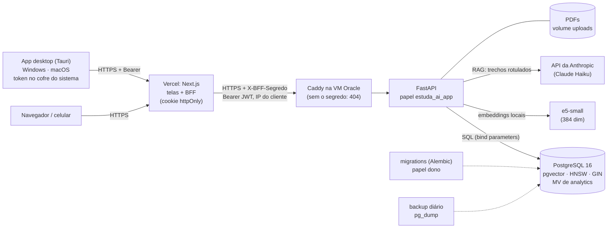

# estuda-ai

Assistente de estudos para universitários. Você cadastra suas disciplinas, envia
materiais (PDFs, anotações) e o sistema faz busca semântica no conteúdo, gera
flashcards e questões com IA, agenda revisões com repetição espaçada e mostra seu
desempenho por disciplina e tópico.

É um projeto de portfólio com um objetivo paralelo: **aprender banco de dados a fundo**
(PostgreSQL, modelagem, índices, transações e busca vetorial). Por isso as decisões de
banco estão explicadas nos commits e em [`docs/`](docs/): [modelagem](docs/modelagem.md),
[busca semântica](docs/busca-semantica.md), [geração com LLM](docs/geracao-llm.md),
[repetição espaçada](docs/repeticao-espacada.md), [analytics](docs/analytics.md),
[segurança](docs/seguranca.md), [frontend](docs/frontend.md), [deploy](docs/deploy.md),
[app desktop e modo foco](docs/modo-foco.md) e [exercícios de SQL](docs/exercicios.md).

## Arquitetura



- **O navegador nunca fala com a API:** o Next guarda o JWT num cookie `httpOnly` e repassa
  as chamadas por uma allowlist ([frontend](docs/frontend.md)).
- **App desktop (Windows e macOS):** as mesmas telas, exportadas como arquivos estáticos
  dentro de um app Tauri. O lado Rust guarda o token no cofre do sistema e chama o mesmo
  BFF ([modo foco](docs/modo-foco.md)).
- **Dois papéis no Postgres:** a API só lê e escreve dados (`estuda_ai_app`); só as
  migrations mudam o schema ([segurança](docs/seguranca.md), seção 6).
- **Busca:** semântica (pgvector + HNSW), textual (tsvector + GIN) e híbrida (RRF), sempre
  filtrada pela disciplina do usuário.
- **Em produção (grátis):** o frontend na Vercel, com deploy a cada push. A API e o
  Postgres ficam numa VM Always Free da Oracle (São Paulo), atrás do Caddy, e só o BFF
  consegue falar com a API ([deploy](docs/deploy.md)).

## Stack

| Camada | Tecnologia |
|---|---|
| Banco | PostgreSQL 16 + [pgvector](https://github.com/pgvector/pgvector) (busca vetorial, índice HNSW) |
| Backend | Python 3.12, FastAPI, SQLAlchemy 2.0, Alembic, Pydantic |
| Busca | embeddings locais (`intfloat/multilingual-e5-small`, 384 dimensões, sentence-transformers) + full-text do Postgres |
| PDF | PyMuPDF |
| LLM | API da Anthropic (SDK `anthropic`), padrão Claude Haiku 4.5, saída estruturada validada com Pydantic |
| Frontend | Next.js 16 + TypeScript + Tailwind, TanStack Query, Recharts; BFF com cookie httpOnly |
| Desktop | Tauri v2 (Rust): exportação estática do Next, token no Keychain/Credential Manager, instaladores pelo GitHub Actions |
| Autenticação | argon2id (senhas) + JWT; papel do banco com menor privilégio |
| Infra | Docker Compose, Caddy (HTTPS), GitHub Actions (testes + gitleaks); produção numa VM Oracle Always Free |
| Testes | pytest contra Postgres real |

## Como rodar

Pré-requisito: Docker com Compose. No macOS sem Docker Desktop, o
[Colima](https://github.com/abiosoft/colima) resolve:

```bash
brew install colima docker docker-compose
```

```bash
colima start
```

Depois, na raiz do projeto:

```bash
cp .env.example .env
```

Edite o `.env`:

- troque `troque-esta-senha` (nas duas linhas: é a senha do **dono** do banco, usada pelas
  migrations) e `troque-esta-outra-senha` (a do papel `estuda_ai_app`, com que a API
  conecta). Use senhas diferentes: ver [menor privilégio](docs/seguranca.md#6-menor-privilégio-no-banco);
- gere o `JWT_SECRET` com `openssl rand -hex 32`;
- para as rotas que usam o LLM, descomente `ANTHROPIC_API_KEY` e coloque sua chave (o
  `.env` nunca vai para o Git).

Então:

```bash
docker compose up --build
```

O backend aplica as migrations sozinho ao subir (`alembic upgrade head`, como dono), dá
login ao papel da aplicação (`scripts/papel_app.py`) e só então sobe a API. A primeira
subida demora: a imagem tem ~1,7 GB (torch para CPU). O modelo de embeddings (~470 MB)
é baixado no primeiro upload e fica no volume `modelos`. Para baixar antes:

```bash
docker compose exec backend python -m app.servicos.embeddings
```

Teste:

```bash
curl localhost:8000/health
```

Resposta esperada: `{"status":"ok","banco":"ok","pgvector":"0.8.7"}`.
A documentação interativa da API fica em http://localhost:8000/docs.

### Testes

Com os containers no ar:

```bash
docker compose exec backend pytest
```

Os testes criam e usam um banco separado (`estuda_ai_test`), então não mexem nos seus dados.
Eles conectam como `estuda_ai_app`, o mesmo papel da API: um teste que precisasse de um
privilégio que a API não tem falharia aqui, e não só em produção.
Eles usam um embedder falso (rápido, sem baixar o modelo). O teste com o modelo real é
separado:

```bash
docker compose exec backend pytest -m modelo
```

### Frontend

Precisa de Node 22+. Com o backend no ar:

```bash
cp frontend/.env.example frontend/.env.local
```

No `frontend/.env.local`, coloque em `BFF_SEGREDO` o **mesmo** valor do `BFF_SEGREDO` do
`.env` da raiz (gere com `openssl rand -hex 32`). Depois:

```bash
npm --prefix frontend install
```

```bash
npm --prefix frontend run dev
```

Abra http://localhost:3000 e entre com a conta criada por `criar_usuario`. Para ver as
telas com dados de 6 semanas, a conta de demonstração local (`estudante@estuda-ai.local`,
senha pública `SENHA_DEV` do script, só para o banco local):

```bash
docker compose exec backend python -m scripts.seed_revisoes --senha-dev
```

O navegador nunca fala direto com a API: o Next guarda o login num cookie `httpOnly` e
repassa as chamadas (ver [docs/frontend.md](docs/frontend.md)).

### App desktop

Baixe o instalador na aba **Releases** do repositório (`.dmg` para macOS, Apple Silicon
ou Intel; `-setup.exe` para Windows). Os apps não têm assinatura paga: o macOS e o Windows
avisam na primeira vez. Veja como abrir em
[docs/modo-foco.md](docs/modo-foco.md#6-instalar-sem-assinatura-de-código).

Para desenvolver (precisa de Rust: `rustup`), com a API e a web (porta 3000) no ar:

```bash
npm --prefix desktop install
```

```bash
ESTUDA_AI_URL=http://localhost:3000 npm --prefix desktop run dev
```

### Explorar o banco

```bash
docker compose exec db psql -U estuda_ai -d estuda_ai
```

Comandos úteis no psql: `\dt` (tabelas), `\d+ flashcards` (estrutura completa),
`\di` (índices).

### Criar a sua conta

Não há cadastro público: a conta é criada por um comando de admin, que pede a senha
(mínimo 8 caracteres) duas vezes sem mostrá-la:

```bash
docker compose exec backend python -m scripts.criar_usuario --email voce@exemplo.com --nome "Seu nome"
```

Esqueceu a senha? Rode de novo com `--redefinir-senha` (isso também desconecta todos os
aparelhos).

### Experimentar a API

Pelo navegador: http://localhost:8000/docs, botão **Authorize** (e-mail no campo
`username`). Pelo terminal, faça login e guarde o token (vale 30 dias):

```bash
TOKEN=$(curl -s localhost:8000/auth/login --data-urlencode 'username=voce@exemplo.com' --data-urlencode 'password=sua senha' | python3 -c 'import sys,json; print(json.load(sys.stdin)["access_token"])')
```

O comando acima deixa a senha no histórico do shell; se preferir, use o `/docs`. Para
desconectar todos os aparelhos: `curl -X POST localhost:8000/auth/sair-de-todos -H "Authorization: Bearer $TOKEN"`.

```bash
curl -X POST localhost:8000/disciplinas -H 'Content-Type: application/json' -H "Authorization: Bearer $TOKEN" -d '{"nome":"Banco de Dados"}'
```

Envie um PDF (responde 202; o processamento roda em background):

```bash
curl -X POST localhost:8000/disciplinas/1/materiais -H "Authorization: Bearer $TOKEN" -F 'arquivo=@aula.pdf;type=application/pdf'
```

Acompanhe o `status` (`pendente` → `processando` → `concluido` ou `erro`):

```bash
curl localhost:8000/disciplinas/1/materiais -H "Authorization: Bearer $TOKEN"
```

Busque (`modo` = `semantica`, `textual` ou `hibrida`):

```bash
curl -G localhost:8000/disciplinas/1/busca -H "Authorization: Bearer $TOKEN" --data-urlencode 'q=como desfazer uma transação' -d k=5 -d modo=hibrida
```

### Experimento de desempenho

Carrega 50 mil trechos sintéticos e compara a busca com e sem o índice HNSW
(resultados em [`docs/experimentos/hnsw.md`](docs/experimentos/hnsw.md)):

```bash
docker compose exec backend python -m scripts.seed_experimento
```

```bash
docker compose exec backend python -m scripts.experimento_hnsw
```

O seed cria o usuário `experimento@estuda-ai.local`; apagá-lo remove tudo em cascata.

### Geração com LLM

Precisa de `ANTHROPIC_API_KEY` no `.env` (depois de editar, recrie o container:
`docker compose up -d backend`). Pergunte ao material:

```bash
curl -X POST localhost:8000/disciplinas/1/perguntar -H "Authorization: Bearer $TOKEN" -H 'Content-Type: application/json' -d '{"pergunta":"O que o ROLLBACK faz?"}'
```

Gere flashcards (de um material ou de um tema) e questões:

```bash
curl -X POST localhost:8000/disciplinas/1/flashcards/gerar -H "Authorization: Bearer $TOKEN" -H 'Content-Type: application/json' -d '{"material_id":1,"quantidade":5}'
```

```bash
curl -X POST localhost:8000/disciplinas/1/questoes/gerar -H "Authorization: Bearer $TOKEN" -H 'Content-Type: application/json' -d '{"tema":"índices","quantidade":3}'
```

Responda uma questão e veja o gasto:

```bash
curl -X POST localhost:8000/disciplinas/1/questoes/1/tentativas -H "Authorization: Bearer $TOKEN" -H 'Content-Type: application/json' -d '{"alternativa":"B","tempo_ms":8000}'
```

```bash
curl localhost:8000/gastos -H "Authorization: Bearer $TOKEN"
```

Nos testes a API da Anthropic é sempre simulada: nenhum teste gasta tokens.

### Revisão com repetição espaçada

Cards vencidos até o fim de hoje (no fuso do usuário), do mais atrasado ao menos:

```bash
curl 'localhost:8000/revisoes/hoje?limite=10' -H "Authorization: Bearer $TOKEN"
```

Registre a nota (0 a 5) mandando a `versao` que veio na fila (409 se o card mudou desde então):

```bash
curl -X POST localhost:8000/revisoes/1 -H "Authorization: Bearer $TOKEN" -H 'Content-Type: application/json' -d '{"nota":4,"versao":0}'
```

Dados realistas (6 semanas simuladas) e o experimento do índice da fila:

```bash
docker compose exec backend python -m scripts.seed_revisoes
```

```bash
docker compose exec backend python -m scripts.experimento_fila
```

### Analytics de desempenho

Dados prontos para plotar (os gráficos são da Fase 6), todos com `disciplina_id` e, quando há
período, `de`/`ate` (datas no fuso do usuário):

```bash
curl 'localhost:8000/analytics/evolucao/semanal' -H "Authorization: Bearer $TOKEN"
```

| Rota | Conteúdo |
|---|---|
| `/analytics/acerto-semanal?por=disciplina\|material` | taxa de acerto por semana |
| `/analytics/evolucao/diaria` e `/analytics/evolucao/semanal` | média móvel de 7 dias e comparação com a semana anterior |
| `/analytics/cards-dificeis` | top N por disciplina (com empates) |
| `/analytics/sequencia` | dias seguidos de estudo: atual e maior |
| `/analytics/previsao` | cards vencendo nos próximos 30 dias |
| `/analytics/calendario` | revisões por dia no último ano (estilo GitHub) |
| `/analytics/custos` | gasto com IA por mês e tipo, acumulado |
| `POST /analytics/atualizar` | refresh da materialized view |

Para volume (200 alunos simulados) e o experimento de performance:

```bash
docker compose exec backend python -m scripts.seed_revisoes --alunos 200
```

```bash
docker compose exec backend python -m scripts.experimento_analytics
```

## Deploy

Grátis, para uso pessoal: o **frontend na Vercel** (importando o repositório, *Root
Directory* `frontend`) e a **API + Postgres numa VM Oracle Always Free** (ARM, São Paulo)
com `docker-compose.prod.yml`. Nela, o Caddy faz o HTTPS e só deixa passar quem traz o
`BFF_SEGREDO`. O passo a passo completo (conta, VM, domínio, chave de deploy, segredos
gerados no servidor, variáveis da Vercel) está em [docs/deploy.md](docs/deploy.md). Em
resumo, já na VM:

```bash
sudo deploy/preparar-servidor.sh
```

```bash
deploy/gerar-env.sh seu-nome.duckdns.org
```

```bash
docker compose -f docker-compose.prod.yml up -d --build
```

Atualizar depois de um push: `deploy/atualizar.sh` (faz backup antes).

### Backup e restore

O cron roda `deploy/backup.sh` todo dia: `pg_dump --format=custom` do banco e um `.tar.gz`
dos PDFs em `~/backups`, com 14 dias de retenção. Puxe as cópias para fora da VM:

```bash
rsync -av -e "ssh -i ~/.ssh/oracle_estuda_ai" ubuntu@IP_DA_VM:backups/ ~/estuda-ai-backups/
```

Restaurar (substitui o banco atual; pede confirmação):

```bash
deploy/restaurar.sh ~/backups/banco_AAAAMMDDTHHMMSSZ.dump ~/backups/uploads_AAAAMMDDTHHMMSSZ.tar.gz
```

O porquê de cada passo (foto consistente do `pg_dump`, papéis que o dump não leva, restore
tudo-ou-nada, RPO de 24 h e PITR) está em [docs/deploy.md](docs/deploy.md).

## Estrutura

```
estuda-ai/
├── docker-compose.yml       # desenvolvimento
├── docker-compose.prod.yml  # produção: Caddy + Next + API + Postgres, 3 redes
├── deploy/                  # Caddyfile, preparar-servidor, gerar-env, backup, restaurar, atualizar
├── .github/workflows/
│   ├── ci.yml               # lint + testes (Postgres+pgvector) + build web/desktop + núcleo Rust + gitleaks
│   └── desktop.yml          # instaladores macOS/Windows (sob demanda: tag desktop-v*)
├── .gitleaks.toml           # exceções (estreitas) da varredura de segredos
├── backend/
│   ├── app/
│   │   ├── main.py          # FastAPI + /health
│   │   ├── models.py        # modelos SQLAlchemy (espelho do schema)
│   │   ├── schemas.py       # contratos Pydantic da API
│   │   ├── deps.py          # dependências (sessão, usuário do token, proteção de IA)
│   │   ├── routers/         # rotas por recurso
│   │   └── servicos/        # pdf, chunking, embeddings, busca, llm, rag, gerar, sm2, revisao, analytics
│   ├── alembic/versions/    # migrations: a fonte da verdade do schema
│   ├── scripts/             # admin (criar_usuario, papel_app), seeds e experimentos
│   └── tests/
├── docs/
│   ├── modelagem.md         # diagrama ER e decisões de banco
│   ├── busca-semantica.md   # embeddings, pgvector, HNSW, full-text, híbrida
│   ├── geracao-llm.md       # RAG, saída estruturada, N:N, alternativas, auditoria
│   ├── repeticao-espacada.md # SM-2, estado x histórico, fila, concorrência, fuso
│   ├── analytics.md         # views, window functions, gaps-and-islands, EXPLAIN
│   ├── seguranca.md         # argon2id, JWT, isolamento, SQL injection, rate limit, privilégios
│   ├── frontend.md          # BFF, cookie httpOnly, contrato tipado, TanStack Query, gráficos
│   ├── deploy.md            # hospedagem, passo a passo, backup/restore, operação
│   ├── modo-foco.md         # app desktop, offline, Spotify, bloqueios
│   ├── exercicios.md        # exercícios de SQL por fase
│   └── experimentos/        # resultados gerados por script
├── desktop/                 # app Tauri v2 (Windows/macOS)
│   ├── nucleo/              # regras puras em Rust (URL da API, allowlist)
│   └── src-tauri/           # janela, ponte para a API, cofre do sistema
└── frontend/
    ├── openapi.json         # contrato exportado do backend (tipos TS gerados dele)
    └── src/
        ├── proxy.web.ts     # sem cookie de sessão -> /login (só na web)
        ├── app/api/         # BFF: /api/sessao, /api/token (desktop) e /api/[...caminho]
        ├── app/(app)/       # disciplinas, revisão, painel, conta
        ├── components/      # ui, gráficos, navegação, tema
        └── lib/             # cliente tipado, hooks (TanStack Query), regras do BFF
```

## Roadmap

- [x] **Fase 1: fundação e modelagem.** Docker Compose, schema com 8 tabelas,
  constraints, índices B-tree e HNSW, migration inicial, `/health`, CRUD de
  disciplinas e testes.
- [x] **Fase 2: materiais e busca semântica.** Upload de PDF com processamento
  transacional em background, chunking com sobreposição, embeddings locais, busca
  semântica (pgvector + HNSW), textual (tsvector + GIN) e híbrida (RRF), e experimento
  com `EXPLAIN ANALYZE`.
- [x] **Fase 3: geração com IA.** Perguntas ao material com citações, flashcards e
  questões gerados pela API da Anthropic a partir dos trechos (RAG), deduplicação com
  pgvector, alternativas em tabela com constraint adiada, tentativas e auditoria de custos
  com `GROUP BY` por disciplina e mês.
- [x] **Fase 4: repetição espaçada.** SM-2 (Python, conferido contra uma versão
  PL/pgSQL), estado 1:1 em `revisoes` + histórico imutável, fila do dia no fuso do usuário
  com índice provado por `EXPLAIN ANALYZE`, controle otimista de concorrência e seed com 6
  semanas de estudo simuladas.
- [x] **Fase 5: analytics.** Endpoints com SQL analítico explícito (GROUPING SETS, window
  functions, LAG, DENSE_RANK, gaps-and-islands, generate_series, percentile_cont), VIEW e
  MATERIALIZED VIEW com REFRESH CONCURRENTLY, e otimização provada com EXPLAIN ANALYZE.
- [x] **Fase 6: frontend, segurança e deploy.**
  - [x] Segurança e CI: login com argon2id + JWT (30 dias, "sair de todos"), sem cadastro
    público, testes de isolamento entre usuários em toda rota, auditoria de SQL injection,
    rate limit e cota diária de IA no Postgres, papel do banco com menor privilégio,
    GitHub Actions (testes contra Postgres+pgvector e gitleaks no histórico).
  - [x] Frontend Next.js: login (cookie httpOnly via BFF), disciplinas, upload com status,
    busca, perguntar com fontes, flashcards, questões, revisão do dia, painel com Recharts e
    conta; celular e modo escuro; tipos gerados do OpenAPI; job do frontend no CI.
  - [x] Deploy: `docker-compose.prod.yml` (Caddy com HTTPS, API e banco sem porta exposta,
    3 redes, backend sem root), scripts de servidor, backup diário com `pg_dump` + restore
    testado num servidor novo, diagrama de arquitetura. Destino: VM Oracle Always Free.
- [ ] **Fase 7: app desktop, sessões de estudo, Spotify e modo foco.**
  - [x] App Tauri v2 para Windows e macOS com as telas do frontend (exportação estática),
    login com token no cofre do sistema, instaladores pelo GitHub Actions.
  - [ ] Sessões de estudo (pomodoro, bloco, 52/17), modo offline com SQLite e chaves de
    idempotência, analytics de foco.
  - [ ] Spotify (OAuth com PKCE, refresh token cifrado, player por método/disciplina).
  - [ ] Modo foco: janela por cima de tudo, bloqueio de programas e de sites (hosts),
    saída de emergência.
