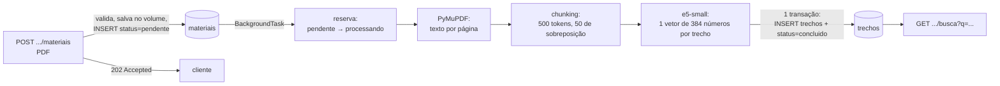

# Busca semântica, textual e híbrida — estuda-ai

Este documento explica a Fase 2: como um PDF vira trechos pesquisáveis e como o
Postgres responde "quais trechos falam disso?". O foco é o banco de dados: tipos,
índices, planos de execução e transações. Os números citados vêm do experimento em
[`experimentos/hnsw.md`](experimentos/hnsw.md) (gerado por script, reproduzível).

---

## 1. O fluxo completo



O que o banco guarda de cada trecho: o texto (`conteudo`), de onde ele veio
(`material_id`, `disciplina_id`, `ordem`, `pagina`, `pagina_fim`), o **embedding**
(`vector(384)`) e um **tsvector** gerado automaticamente (`conteudo_tsv`). Duas
representações do mesmo texto, uma para cada tipo de busca.

O PDF em si fica num volume Docker (`/data/uploads`). O banco guarda só o caminho
relativo. Binários grandes no Postgres incham o backup e o WAL (o log de escrita) e
ocupam o cache de páginas (`shared_buffers`) sem que nenhuma consulta precise deles.

---

## 2. O que são embeddings

Um **embedding** é uma lista de números (um vetor) que representa o *significado* de
um texto. O modelo `intfloat/multilingual-e5-small` transforma qualquer texto em 384
números. Ele foi treinado para que textos com sentido parecido virem vetores que
**apontam para direções parecidas**, mesmo sem palavras em comum:

- "como voltar atrás quando algo dá errado no meio" → perto de um parágrafo sobre
  `ROLLBACK` e atomicidade;
- "estrutura para achar registros rapidamente" → perto de um parágrafo sobre índices B-tree.

(Os dois exemplos estão no teste `test_modelo_real_encontra_por_significado...`,
rodado com `pytest -m modelo`.)

### Similaridade de cosseno

A "parecença" entre dois vetores é medida pelo **ângulo** entre eles:

```
similaridade = cos(θ) = (a · b) / (|a| × |b|)        distância de cosseno = 1 − similaridade
```

- 1 = mesma direção (mesmo sentido); 0 = perpendiculares (sem relação); −1 = opostos.
- O módulo (comprimento) do vetor não importa, só a direção.

O código pede ao modelo vetores **normalizados** (comprimento 1). Aí `|a| = |b| = 1` e
a similaridade de cosseno vira simplesmente o produto escalar `a · b`. Por isso, com
vetores normalizados, os três operadores do pgvector dão **a mesma ordenação**:

| Operador | Mede | opclass do índice |
|---|---|---|
| `<=>` | distância de cosseno | `vector_cosine_ops` (o nosso) |
| `<->` | distância euclidiana (L2) | `vector_l2_ops` |
| `<#>` | produto interno **negativo** | `vector_ip_ops` |

> **Regra que pega muita gente:** o índice só é usado se o operador do `ORDER BY` for
> o mesmo do opclass. Nosso HNSW foi criado com `vector_cosine_ops`, então
> `ORDER BY embedding <-> :q` faria busca exata (sem índice), mesmo dando a mesma ordem.

### Detalhes do e5 que afetam o banco

- **Prefixos:** o e5 foi treinado com `"passage: "` nos documentos e `"query: "` nas
  perguntas. Esquecer os prefixos piora a busca sem dar erro nenhum.
- **Limite de 512 tokens:** por isso os trechos têm até 500 (sobra espaço para o
  prefixo e os tokens especiais). O que passa do limite é cortado em silêncio.
- **Scores comprimidos:** no e5, quase tudo tem similaridade entre 0,75 e 0,9. Nos nossos
  testes, com textos de uma frase, o trecho certo ganhou do errado por 0,002 (cara ou
  coroa). Com parágrafos do tamanho de um trecho real, as margens subiram para
  0,006–0,023 e o modelo acertou as três perguntas. Conclusões práticas: (1) nunca use um
  limiar fixo do tipo "score > 0,8 = relevante"; (2) compare posições, não valores; (3) é
  um argumento a favor da busca híbrida (seção 7).

### Trocar de modelo = migration + reprocessar tudo

A Fase 1 criou `vector(1024)`; o e5-small gera 384. A migration
`embedding_384_dimensoes` mudou a coluna com `USING NULL`: **não existe conversão** de
um embedding de um modelo para outro, porque cada modelo define seu próprio espaço
vetorial. O código confere na carga do modelo se a dimensão bate com `EMBEDDING_DIM` e
falha cedo, em vez de deixar o banco recusar cada INSERT com `expected 384 dimensions`.

---

## 3. Como o pgvector guarda os vetores

- `vector(384)` ocupa 4 bytes por número + 8 de cabeçalho = **1.544 bytes por linha**.
  Com o texto, cada trecho tem ~2–4 KB; cabem poucas linhas por página de 8 KB.
  No experimento: 50 mil trechos = 186 MB de tabela.
- O tipo valida a dimensão: um vetor com 3 números numa coluna `vector(384)` é recusado
  (`test_embedding_precisa_ter_384_dimensoes`).
- Busca **exata** = calcular a distância para todas as linhas candidatas e ordenar. Para
  k pequeno o Postgres usa um *top-N heapsort* (mantém só os k melhores na memória).
  O custo é O(n): dobrou a disciplina, dobra o tempo.

---

## 4. HNSW: busca aproximada

### Como funciona

O **HNSW** (*Hierarchical Navigable Small World*) é um grafo em camadas:

```
camada 2:   A ─────────────── F                 (poucos nós, ligações longas)
camada 1:   A ──── C ──── F ──── H
camada 0:   A─B─C─D─E─F─G─H─I─J─K─...           (todos os nós, ligações curtas)
```

A busca começa no topo, anda gulosamente para o vizinho mais próximo da consulta,
desce uma camada e repete, como achar uma rua: primeiro a rodovia, depois a avenida,
depois o quarteirão. Na camada de baixo mantém uma fila dos `ef_search` melhores
candidatos e devolve os k mais próximos. Visita centenas de nós em vez de 40 mil.

- **Aproximado:** pode deixar de visitar o vizinho verdadeiro. A qualidade se mede com
  **recall@k** = dos k vizinhos exatos, quantos a busca devolveu.
- `m = 16`: ligações por nó. Mais = grafo melhor e índice maior.
- `ef_construction = 64`: candidatos avaliados ao inserir. Mais = grafo melhor e build mais lento.
- `hnsw.ef_search` (padrão 40): tamanho da fila **na consulta**. É o botão
  velocidade × recall, ajustável por transação.
- O HNSW devolve **no máximo `ef_search` linhas**. Pedir `LIMIT 100` com `ef_search = 40`
  traz 40. Por isso `app/servicos/busca.py` faz `ef_search = max(40, k)`.

### O que o experimento mostrou (50 mil trechos, disciplina com 40 mil)

| Estratégia | Mediana | Recall@10 |
|---|---:|---:|
| Exata (sem HNSW) | 19,7 ms | 1,000 |
| HNSW, `ef_search = 40` | 0,50 ms | 0,862 |
| HNSW, `ef_search = 100` | 0,65 ms | 0,922 |
| HNSW, `ef_search = 200` | 0,77 ms | 0,998 |

- **~25 a 40 vezes mais rápido**, e o ganho cresce com a tabela (exata é O(n), HNSW
  cresce bem devagar).
- Com `ef_search = 40`, 14% dos vizinhos verdadeiros se perdem. Com 200, quase nenhum,
  ainda abaixo de 1 ms. Para RAG, onde perder o trecho certo significa uma resposta pior,
  vale aumentar o `ef_search`.
- Os vetores do seed são sintéticos (agrupados em tópicos com bastante ruído). Com
  embeddings reais o recall costuma ser maior, mas a forma da curva é a mesma.

### O preço do índice

| | |
|---|---|
| Tamanho | 102 MB: **metade do tamanho da tabela** |
| INSERT linha a linha | ~1.400/s com o HNSW, ~22.500/s sem (~16× mais lento) |
| Build depois da carga | 8,6 s para 50 mil vetores (com 2 workers paralelos) |

Daí a receita de **carga em massa** do `seed_experimento.py`: `DROP INDEX` → `COPY` →
`CREATE INDEX` → `ANALYZE`. Construir o grafo uma vez com tudo é muito mais barato que
inserir vetor por vetor. Na primeira tentativa, o build paralelo falhou com
`could not resize shared memory segment`: o Docker dá só 64 MB de `/dev/shm`, e o
Postgres usa memória compartilhada para os workers paralelos. A correção foi
`shm_size: 1gb` no compose.

### Por que HNSW e não IVFFlat

O IVFFlat (o outro índice do pgvector) agrupa os vetores com k-means e só procura nos
grupos mais próximos da consulta. Ele constrói mais rápido e ocupa menos espaço, mas
precisa ser criado **depois** que os dados existem (os grupos saem dos dados) e piora
conforme dados novos chegam sem refazer os grupos. Num app em que materiais entram o
tempo todo, o HNSW se mantém bom sozinho.

---

## 5. Filtro + índice aproximado: o problema da disciplina

Toda busca do app é "trechos parecidos **desta disciplina**". Parece só um `WHERE`, mas
com um índice aproximado é traiçoeiro. O HNSW acha os `ef_search` vizinhos mais próximos
**da tabela inteira**, e só depois o filtro descarta os de outras disciplinas.

Experimento, disciplina com 500 trechos (1% da tabela), HNSW forçado:

```
Limit (actual time=0.207..0.207 rows=0 loops=1)
  ->  Index Scan using ix_trechos_embedding_hnsw on trechos (rows=0)
        Order By: (embedding <=> '[...]'::vector)
        Filter: (disciplina_id = 33)
        Rows Removed by Filter: 40
```

Os 40 vizinhos encontrados (= `ef_search`) eram todos de outras disciplinas: **0 linhas
devolvidas** para um `LIMIT 10`. Na média das 50 consultas, vieram 1,5 de 10.

Duas defesas, as duas aplicadas no projeto:

**1. Iterative scan (pgvector 0.8+).** Com `hnsw.iterative_scan = strict_order`, quando o
filtro descarta linhas o índice continua andando no grafo até juntar k linhas. Resultado:
10 de 10 linhas, recall 0,878, mas 3,3 ms de mediana e p95 de 13 ms (precisou andar
muito para achar 1% da tabela).

**2. `disciplina_id` copiado em `trechos` + B-tree (a desnormalização da migration
`trechos_disciplina_id_e_pagina_fim`).** Com o filtro e um índice comum na própria
tabela, o planejador ganha uma alternativa: buscar as 500 linhas da disciplina pelo
B-tree e calcular a distância exata só para elas.

| Disciplina pequena (500 trechos) | Mediana | Recall@10 | Linhas |
|---|---:|---:|---:|
| **Planejador decide** (todos os índices) | **0,20 ms** | **1,000** | 10 de 10 |
| HNSW forçado, sem iterative scan | 0,44 ms | 0,148 | 1,5 de 10 |
| HNSW forçado, com iterative scan | 3,32 ms | 0,878 | 10 de 10 |

O planejador escolheu sozinho `Index Scan (ix_trechos_disciplina_id) → Sort → Limit`:
busca **exata**, mais rápida que o HNSW e com recall perfeito. Para a disciplina grande,
escolheu o HNSW. É o planejador baseado em custo fazendo o trabalho dele, desde que
tenha as opções (os índices) e as estatísticas (`ANALYZE`) para decidir.

Por que não deixar o filtro num JOIN com `materiais`? Porque aí não existe índice que
filtre `trechos` por disciplina; o planejador só teria o HNSW + filtro depois do JOIN.

A cópia não pode divergir do original, e quem garante isso é a **FK composta**
`trechos(material_id, disciplina_id) → materiais(id, disciplina_id)` com
`ON UPDATE CASCADE` (ver `docs/modelagem.md`, seção 4b).

### Um detalhe do plano: Index Scan para ler 80% da tabela

Na busca exata da disciplina grande, o planejador usou o B-tree para ler 40 mil das 50
mil linhas, quando se esperaria um Seq Scan. O motivo está em `pg_stats`:

```sql
SELECT attname, correlation FROM pg_stats WHERE tablename = 'trechos';
-- disciplina_id | 1.000
```

`correlation = 1` significa que a ordem física das linhas no disco é a mesma do índice
(o seed inseriu disciplina por disciplina). Então percorrer o índice lê o heap em
sequência, sem pular páginas, e ainda pula os 20% de outras disciplinas. Num banco real,
com materiais chegando misturados, a correlação cai e o mesmo plano ficaria caro.

---

## 6. Full-text search: tsvector, tsquery e GIN

A busca textual do Postgres não é um `LIKE '%palavra%'` (que não usa índice B-tree e não
entende plural nem acento). Ela trabalha com **lexemas**:

```sql
SELECT to_tsvector('portugues_unaccent', 'Índices aceleram consultas');
-- 'acel':2 'consult':3 'indic':1
```

1. **Tokenização:** o texto vira palavras (o parser sabe o que é palavra, número, e-mail...).
2. **Dicionários**, em sequência: `unaccent` tira os acentos e o `portuguese_stem` (Snowball)
   reduz ao radical: "Índices" → "indices" → "indic". Stopwords ("o", "de", "que") somem.
3. **tsvector:** a lista ordenada de lexemas com as posições onde apareceram.

A consulta passa pelo mesmo processo e vira uma **tsquery**; `tsvector @@ tsquery` diz se casa.

| Função | "índice rollback" vira | Uso |
|---|---|---|
| `websearch_to_tsquery` | `'indic' & 'rollback'` | modo `textual`: aceita `"frase"`, `OR`, `-excluir` |
| `plainto_tsquery` | `'indic' & 'rollback'` | base da perna textual da híbrida (com `&` trocado por `\|`) |

### A configuração `portugues_unaccent`

A configuração `portuguese` nativa não tira acentos: "indice" não acharia "índice".
Criamos uma cópia com `unaccent` antes do stemmer (migration `busca_textual_em_trechos`):

```sql
CREATE TEXT SEARCH CONFIGURATION portugues_unaccent (COPY = portuguese);
ALTER TEXT SEARCH CONFIGURATION portugues_unaccent
    ALTER MAPPING FOR hword, hword_part, word WITH unaccent, portuguese_stem;
```

### Coluna gerada

```sql
conteudo_tsv tsvector GENERATED ALWAYS AS (to_tsvector('portugues_unaccent'::regconfig, conteudo)) STORED
```

- O banco recalcula em todo INSERT/UPDATE de `conteudo`, e ninguém consegue gravar um
  tsvector desatualizado. A alternativa antiga era um trigger.
- A expressão precisa ser **IMMUTABLE** (mesma entrada → mesma saída, sempre).
  `to_tsvector(texto)` sem configuração não é, porque depende do parâmetro
  `default_text_search_config` da sessão. Com `'...'::regconfig` explícito, é.
- Pegadinha: se a configuração `portugues_unaccent` mudar, os valores já gravados não
  são recalculados sozinhos (`UPDATE trechos SET conteudo = conteudo` força).

### Índice GIN

**GIN** (*Generalized Inverted Index*) é um índice **invertido**: para cada lexema, a lista
de linhas que o contêm, como o índice remissivo no fim de um livro. `@@` com
`'indic' & 'rollback'` vira "interseção das listas de `indic` e `rollback`". No
experimento, o GIN de 50 mil trechos ocupou ~6 MB, contra 102 MB do HNSW.

### Ranking

`ts_rank_cd` (*cover density*) pontua por quantos termos aparecem e quão **próximos**
estão. Com a flag 32 o valor vira `rank/(rank+1)`, entre 0 e 1. Ele não é comparável com
a similaridade de cosseno, e isso importa na seção 7.

---

## 7. Quando cada busca funciona melhor

| Situação | Melhor | Por quê |
|---|---|---|
| Termo exato, sigla, nome próprio, código (`ROLLBACK`, `3FN`, `pg_stats`) | **textual** | o embedding "dilui" termos raros; o GIN acha a palavra exata |
| Pergunta em linguagem natural, paráfrase, sinônimo ("voltar atrás" ≈ ROLLBACK) | **semântica** | não precisa de palavras em comum |
| Frase exata (`"forma normal"`) ou exclusão (`-oracle`) | **textual** | `websearch_to_tsquery` suporta |
| Pergunta longa ("como desfazer operações quando algo falha") | **semântica** | no textual (AND) teria de conter **todas** as palavras: no teste real, 0 resultados |
| Não sabe qual dos casos acima | **híbrida** | pega o melhor das duas |

---

## 8. Busca híbrida com Reciprocal Rank Fusion

Combinar as duas buscas somando os scores não funciona: cosseno fica entre 0,75 e 0,9 no
e5, e o `ts_rank_cd` em outra escala. Qualquer soma ou média favoreceria uma delas por
acidente. O **RRF** ignora os valores e usa só as **posições**:

```
score_RRF(trecho) = 1/(60 + posição_semântica) + 1/(60 + posição_textual)
```

(uma parcela some se o trecho não aparece naquela lista)

- 1º lugar nas duas: 1/61 + 1/61 = 0,0328. 1º numa e ausente na outra: 0,0164.
  **Aparecer nas duas listas pesa mais que liderar uma só.**
- O 60 (do artigo original, Cormack et al. 2009) suaviza a diferença entre posições:
  1º e 2º lugar valem quase o mesmo (0,0164 × 0,0161), e uma lista não domina a outra.

Em SQL (`SQL_HIBRIDA` em `app/servicos/busca.py`):

1. CTE `semantica`: os N vizinhos por `<=>`, com `row_number() OVER (ORDER BY distancia)`
   para numerar as posições (uma **window function**, assunto da fase 5).
2. CTE `textual`: os N melhores por `ts_rank_cd`, também numerados.
3. `FULL OUTER JOIN` das duas pelo `id`: um trecho pode estar só numa, só na outra ou
   nas duas. `coalesce(..., 0)` zera a parcela que falta.
4. Cada lista traz `N = max(4k, 20)` candidatos: um trecho em 8º nas duas listas pode
   terminar em 1º na fusão.

Uma escolha importante: na perna textual da híbrida, as palavras são unidas com **OU**
(`'indic' | 'rollback'`). Com E, uma pergunta longa quase nunca casa e a híbrida viraria
só semântica. Com OU, trechos com parte das palavras entram, e o `ts_rank_cd` põe na
frente quem tem mais delas (`test_busca_hibrida_usa_ou_na_parte_textual`).

---

## 9. O pipeline de upload e as transações

### Máquina de estados

```
pendente ──reserva──▶ processando ──sucesso──▶ concluido
                                  └──falha───▶ erro ──reprocessar──▶ pendente
```

O status é `text + CHECK (status IN (...))`. Renomear `processado` para `concluido` (a
Fase 1 usava o primeiro) foi uma migration de três linhas: DROP CONSTRAINT, UPDATE, ADD
CONSTRAINT. Com um `ENUM` do Postgres, isso seria bem mais trabalhoso. Dois CHECKs
condicionais protegem a coerência ("se A então B" em SQL = `NOT A OR B`):

- `erro_mensagem IS NULL OR status = 'erro'`
- `tipo <> 'pdf' OR caminho_arquivo IS NOT NULL`

### Três transações curtas

`app/servicos/processamento.py`:

**1. Reserva: compare-and-set.**
```sql
UPDATE materiais SET status = 'processando'
WHERE id = :id AND status = 'pendente'
RETURNING caminho_arquivo, disciplina_id;
```
Se duas execuções tentarem o mesmo material ao mesmo tempo, a primeira trava a linha; a
segunda espera, reavalia o `WHERE` depois do COMMIT da primeira, não acha mais
`'pendente'` e atualiza 0 linhas. Sem `SELECT ... FOR UPDATE` separado, sem condição de
corrida (`test_processar_de_novo_um_material_ja_concluido_nao_faz_nada`). O
`POST .../reprocessar` usa o mesmo truque para `erro → pendente`.

**Entre 1 e 2, nada de transação aberta.** Extração, chunking e embeddings levam segundos
de CPU. Uma transação aberta nesse tempo seguraria o lock da linha e um *snapshot*
antigo, e o VACUUM não pode limpar versões mortas de linhas que algum snapshot ainda
possa enxergar.

**2. Gravação: atomicidade.** Todos os `INSERT INTO trechos` e o
`UPDATE ... status = 'concluido'` vão na **mesma transação**:

- **Atomicidade** (o A de ACID): no COMMIT tudo vira visível de uma vez; se qualquer passo
  falhar, o ROLLBACK desfaz todos os INSERTs já feitos.
- **Isolamento**: enquanto não há COMMIT, nenhuma outra conexão vê os trechos novos. Uma
  busca durante o processamento não encontra um material "pela metade".

O teste `test_falha_no_meio_da_gravacao_nao_deixa_trechos_pela_metade` força o último
trecho a repetir a `ordem` do penúltimo, violando o UNIQUE `(material_id, ordem)`. Os
trechos válidos anteriores também somem, e o status vai para `erro` com o nome da
constraint na mensagem.

**3. Registro do erro: transação nova.** Depois de um erro, uma transação do Postgres fica
abortada e recusa qualquer comando ("current transaction is aborted, commands ignored
until end of transaction block") até o ROLLBACK. Por isso o `status = 'erro'` é gravado
numa transação separada.

### Atomicidade vista na prática (por acidente)

Duas falhas reais desta fase mostraram o DDL transacional funcionando:

1. Ao rodar as quatro migrations novas de uma vez, a segunda falhou (um nome de constraint
   errado). O `alembic upgrade head` roda tudo numa transação, e a **primeira migration,
   que já tinha terminado, também foi desfeita**: a coluna continuou `vector(1024)`.
2. O seed falhou no `CREATE INDEX` (o `/dev/shm` do Docker). O `DROP INDEX` e os
   INSERTs anteriores, na mesma transação, foram desfeitos: o banco ficou exatamente como antes.

### Disco e banco: dois sistemas, nenhuma transação comum

O arquivo vai para o disco e o registro vai para o banco, e não existe COMMIT que cubra
os dois (o problema da *dual write*). O código ordena as operações para que a falha
deixe, no pior caso, lixo inofensivo:

- **Upload:** grava o arquivo (num `.parcial` renomeado no fim; `rename` é atômico) e
  depois faz o INSERT. Se o INSERT falha (ex.: arquivo repetido → 409), apaga o arquivo à mão.
- **Apagar:** primeiro o DELETE no banco (COMMIT), depois o arquivo. Se o banco falhar, nada
  se perdeu; se apagar o arquivo falhar, sobra um arquivo órfão. A ordem inversa deixaria
  um registro apontando para um arquivo inexistente.
- Apagar uma **disciplina** ainda deixa os PDFs órfãos no volume. Uma rotina de limpeza
  (comparar arquivos com `materiais.caminho_arquivo`) está no roadmap.

---

## 10. Limitações conhecidas e próximos passos

- **BackgroundTasks** roda no mesmo processo da API. Se a API reiniciar no meio, o material
  fica preso em `processando`. Uma fila real (ou um worker que use
  `SELECT ... FOR UPDATE SKIP LOCKED` para pegar materiais pendentes) resolveria; também dá
  para detectar "processando há mais de X minutos".
- PDFs escaneados (só imagem) terminam em `erro`; seria preciso OCR.
- O modelo roda em CPU dentro do container: ~9 s para um PDF de 3 páginas incluindo a carga
  do modelo, bem menos depois que ele já está carregado.
- `ef_search` fixo em 40 (ou k): o experimento sugere que 100–200 compensa para RAG.
- Fase 6: medir com dados reais e com mais volume, e ajustar `m`/`ef_construction`.
