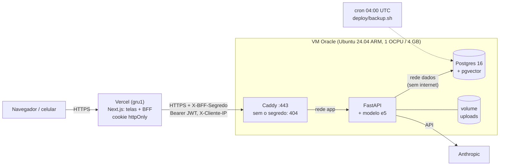

# Deploy

Fase 6, parte 3. Produção grátis para uso pessoal: o frontend na **Vercel** (deploy a
cada push no GitHub) e a API com o Postgres numa VM **Always Free da Oracle Cloud** (região
São Paulo), num `docker compose` parecido com o do desenvolvimento.

## 1. Por que esta hospedagem

Requisitos medidos: o backend usa cerca de **910 MB de RAM** com o modelo de embeddings
carregado (a imagem tem 1,8 GB por causa do torch). Somam-se o Postgres com pgvector,
disco persistente para os PDFs e um servidor Node para o Next, porque o BFF não roda como
site estático. Em resumo: uma máquina de 2 GB no mínimo.

Opções comparadas em out/2026 (preços mudam; confira antes):

| | Custo | RAM | Problema |
|---|---|---|---|
| **Oracle Always Free, São Paulo** (escolhida) | R$ 0 | até 12 GB ARM | regras mudam sem aviso; VM "ociosa" pode ser recuperada; cartão no cadastro |
| VPS no Brasil (Hostinger KVM 2) | ~R$ 44/mês em contrato de 24 meses | 8 GB | pago; servidor administrado por você |
| Vercel + Railway + Neon | ~US$ 10–15/mês | paga por GB | 3 painéis; banco grátis de 0,5 GB; sem região no Brasil |
| Hetzner (CAX11) | €5,99/mês | 4 GB | restringindo servidores novos desde abr/2026; Europa |
| Render | US$ 25/mês (2 GB) | 2 GB | caro para o projeto |

O critério do autor foi **grátis e só para uso pessoal**, com o frontend publicado pela
**Vercel** a partir do GitHub. A Vercel não roda a API (seção 2), então a combinação ficou
**Vercel (Next) + Oracle Always Free (API e banco)**: as duas grátis. A alternativa mais
segura seria rodar no próprio Mac com Tailscale (sem nada exposto na internet). A Oracle
ganhou por ser um deploy de verdade, sempre ligado e acessível de qualquer lugar.

### Os riscos da Oracle e o que fazer com eles

- **VM "ociosa" é recuperada.** A Oracle pode recuperar uma VM Always Free que fique 7 dias
  com CPU, rede **e** memória abaixo de 20% (a memória conta só nas VMs ARM). Um app pessoal
  fica quase sempre abaixo de 20% de CPU e de rede, então a **memória** é o que segura a VM.
  Medido na pilha de produção (seção 8): uns 1,05 GB nos containers com o modelo
  carregado, uns 1,4 GB com o sistema. Em 12 GB isso dá 12% (ociosa); em 6 GB, 23% (no
  limite). **Crie a VM com 1 OCPU e 4 GB:** cerca de 35% de uso, e ainda sobram 2,5 GB
  (mais 2 GB de swap para o build).
- **As regras mudam.** Em 2026 a Oracle cortou o limite grátis pela metade (de 4 OCPU/24 GB
  para 2/12) sem anúncio, e desligou as VMs acima do novo limite. A defesa é não depender
  da VM: backup diário puxado para fora (seção 5), e o mesmo `docker compose` sobe em
  qualquer outra VPS em minutos.
- **"Out of host capacity" ao criar a VM:** a região não tem VM ARM livre naquele momento.
  Tente outro *availability domain* ou outro horário.

## 2. Arquitetura: Vercel (frontend) + Oracle (API e banco)

O autor pediu para publicar o frontend pela Vercel, ligada ao repositório do GitHub
(deploy automático a cada push). A Vercel só roda o Next: a API precisa de um processo
sempre ligado com ~1 GB de RAM, Postgres e disco, que ficam na VM da Oracle.



- Na VM, só o **Caddy** publica portas (80/443). O banco não tem porta, e a rede `dados` é
  `internal` (o Postgres nem sai para a internet). O backend roda sem root e sem as
  ferramentas de desenvolvimento.
- **A API só existe para o BFF.** O Caddy só repassa requisições que trazem o
  `X-BFF-Segredo` certo. Para qualquer outro (robôs, scanners, quem descobrir o domínio),
  tudo responde 404, inclusive `/docs` e `/auth/login`. Testado: sem segredo ou com
  segredo errado dá 404; com o segredo, a requisição chega à API. O `/health` fica aberto
  para monitoramento.
- **IP do cliente:** a Vercel sobrescreve o `X-Forwarded-For` (contra falsificação). O
  BFF repassa esse IP em `X-Cliente-IP`, e a API só aceita o valor junto com o segredo.
- **Limites da Vercel (plano Hobby):**
  - Uma função pode rodar até 300 s, folga para as gerações com IA (`maxDuration = 120`
    no BFF).
  - O corpo da requisição tem no máximo **4,5 MB**. Como o PDF passa pelo BFF, o frontend
    recusa antes de enviar um PDF acima de `NEXT_PUBLIC_LIMITE_UPLOAD_MB` (padrão 4) e
    sugere comprimir. A solução completa é um upload direto do navegador para a API, com
    um tíquete de curta duração assinado pela API (o padrão *presigned upload*). Fica
    como próximo passo.
  - Uso não comercial (projeto pessoal).
- Alternativa sem Vercel (tudo na VM): `CADDYFILE=Caddyfile.completo` + perfil
  `frontend-na-vm` no compose. O Caddy então serve o Next, e a API nem é publicada.

## 3. Variáveis de ambiente (nunca no código)

**Na VM:** o `.env` é gerado no próprio servidor por `deploy/gerar-env.sh`. Cada segredo
sai de `openssl rand -hex 32`, com permissão 600, sem passar por chat, e-mail ou git.

| Variável | db | backend | Caddy |
|---|---|---|---|
| `POSTGRES_*` (dono) | sim | via `MIGRATION_DATABASE_URL` | não |
| `DATABASE_URL` (papel da app) | não | sim | não |
| `JWT_SECRET` | não | sim | não |
| `BFF_SEGREDO` | não | sim | sim (para barrar quem não o traz) |
| `ANTHROPIC_API_KEY` | não | sim | não |
| `DOMINIO` | não | não | sim |

**Na Vercel** (Settings → Environment Variables), só três, nenhuma senha de banco:

| Variável | Valor |
|---|---|
| `BACKEND_URL` | `https://<seu-subdominio>.duckdns.org` (a API na VM) |
| `BFF_SEGREDO` | o **mesmo** valor do `.env` da VM |
| `NEXT_PUBLIC_LIMITE_UPLOAD_MB` | `4` (opcional; é o padrão) |

## 4. Passo a passo (tarefas manuais)

Eu não crio contas nem digito cartão ou senha por você. Cada passo diz onde fazer.

### Parte A: a VM na Oracle (API e banco)

**A1. Conta na Oracle Cloud.** A região principal (*home region*) deve ser **Brazil
East (São Paulo)**: ela não muda depois, e o Always Free só vale nela. (Se já criou a conta
com outra região, a VM grátis tem de ficar nessa outra região. Funciona, só com mais
latência.)

**A2. Chave SSH, no Mac** (para entrar na VM):

```bash
ssh-keygen -t ed25519 -f ~/.ssh/oracle_estuda_ai -C "estuda-ai oracle"
```

**A3. Criar a VM, no console da Oracle** (menu ☰ → Compute → Instances → Create instance):

- **Image:** Change image → Ubuntu → **Canonical Ubuntu 24.04** (a versão *aarch64*);
- **Shape:** Change shape → Ampere → **VM.Standard.A1.Flex**, com **1 OCPU e 4 GB** de
  memória (ver seção 1: com mais memória a VM pode ser recuperada como "ociosa");
- **Networking:** deixe criar a VCN nova e marque **Assign a public IPv4 address**;
- **Add SSH keys:** "Paste public keys" e cole a saída de `cat ~/.ssh/oracle_estuda_ai.pub`;
- **Boot volume:** o padrão (~50 GB).

Em **Create**, se aparecer *Out of capacity for shape*: a Oracle não tem VM ARM livre na
região naquele momento. São Paulo tem um *availability domain* só, então trocar de AD não
resolve. Ou você tenta mais tarde, ou deixa um script tentando sozinho (abaixo). Quando a
VM estiver *Running*, anote o **Public IP address**.

**A3b. (Se der "Out of capacity") Criar a VM por script, tentando até conseguir.** A
capacidade abre quando outras pessoas apagam VMs, a qualquer hora.
`deploy/oracle-criar-vm.sh` usa a OCI CLI para tentar a cada ~90 s e avisa com uma
notificação do macOS quando consegue.

- Ele descobre sozinho a rede, a subnet pública e a imagem Ubuntu 24.04 ARM.
- Cria sempre 1 OCPU e 4 GB (fixo no código, para nenhum engano criar algo pago).
- Nunca cria duas VMs.

Antes de usar, é preciso configurar a OCI CLI:

1. Instale: `brew install oci-cli`.
2. No console: ícone do perfil (canto superior direito) → **My profile** → **API keys** →
   **Add API key** → **Generate API key pair** → **Download private key** → **Add**.
3. Copie o texto de **Configuration file preview** que aparece.
4. No Mac, guarde a chave privada baixada e crie a configuração:

   ```bash
   mkdir -p ~/.oci && mv ~/Downloads/*.pem ~/.oci/oci_api_key.pem && chmod 600 ~/.oci/oci_api_key.pem
   ```

   ```bash
   nano ~/.oci/config
   ```

   Cole o *Configuration file preview* e troque a linha `key_file=...` por
   `key_file=~/.oci/oci_api_key.pem`. Salve (Ctrl+O, Enter, Ctrl+X) e rode
   `chmod 600 ~/.oci/config`.
5. Teste: `oci iam region list --output table` deve listar as regiões.
6. Rode, com o Mac na tomada e a tampa aberta:

   ```bash
   caffeinate -i deploy/oracle-criar-vm.sh
   ```

A chave `.pem` dá acesso à sua conta Oracle: ela fica só em `~/.oci`, nunca no repositório
nem no chat.

**A4. Liberar 80 e 443 na rede da Oracle.** Na página da VM → a *Subnet* → *Security
Lists* → *Default Security List* → **Add Ingress Rules**:

- Source CIDR `0.0.0.0/0`, IP Protocol **TCP**, Destination Port Range **80**;
- outra regra igual com **443**.

(O firewall do próprio Ubuntu é a segunda camada; o script do passo A7 cuida dele.)

**A5. Domínio grátis.** Em duckdns.org (login com GitHub), crie um subdomínio, por exemplo
`meu-estuda-ai`, e em *current ip* coloque o IP público da VM. O endereço da API será
`https://meu-estuda-ai.duckdns.org`. O Caddy precisa do domínio para o certificado HTTPS.

**A6. Entrar na VM e clonar o repositório (privado) com uma chave só de leitura:**

```bash
ssh -i ~/.ssh/oracle_estuda_ai ubuntu@IP_DA_VM
```

Já dentro da VM:

```bash
ssh-keygen -t ed25519 -f ~/.ssh/github_estuda_ai -N "" -C "deploy estuda-ai"
```

```bash
printf 'Host github.com\n  IdentityFile ~/.ssh/github_estuda_ai\n' >> ~/.ssh/config
```

```bash
cat ~/.ssh/github_estuda_ai.pub
```

Cole essa chave **pública** no GitHub: repositório → Settings → Deploy keys → Add deploy
key, **sem** marcar "Allow write access". Ela dá acesso de leitura a este repositório e a
nada mais. Depois:

```bash
git clone git@github.com:bergols/estuda-ai.git && cd estuda-ai
```

**A7. Preparar o servidor** (Docker, firewall, atualizações automáticas, swap, SSH só com
chave, backup diário):

```bash
sudo deploy/preparar-servidor.sh
```

Saia (`exit`) e entre de novo no SSH (para o grupo `docker` valer).

**A8. Gerar o `.env` e subir a API:**

```bash
cd estuda-ai && deploy/gerar-env.sh meu-estuda-ai.duckdns.org
```

```bash
docker compose -f docker-compose.prod.yml up -d --build
```

A primeira subida leva uns 10 a 15 minutos (o torch é grande). Depois, baixe o modelo de
embeddings uma vez:

```bash
docker compose -f docker-compose.prod.yml exec backend python -m app.servicos.embeddings
```

Teste no navegador do Mac: `https://meu-estuda-ai.duckdns.org/health` deve mostrar
`{"status":"ok",...}`, e `https://meu-estuda-ai.duckdns.org/docs` deve dar **404**. É o
Caddy escondendo a API de quem não é o BFF.

**A9. Criar a sua conta** (a senha é pedida duas vezes, sem aparecer na tela):

```bash
docker compose -f docker-compose.prod.yml exec backend python -m scripts.criar_usuario --email voce@exemplo.com --nome "Seu nome"
```

**A10. Copiar o segredo do BFF para colar na Vercel:**

```bash
grep ^BFF_SEGREDO= .env
```

Copie só o valor depois do `=`. **Não cole isso no chat** nem em lugar nenhum além do
painel da Vercel.

### Parte B: o frontend na Vercel

**B1.** Em vercel.com, entre com o GitHub. **Add New → Project** e importe
`bergols/estuda-ai`. Se ele não aparecer, use "Adjust GitHub App Permissions" e dê acesso a
esse repositório.

**B2. Root Directory:** clique em *Edit* e escolha **`frontend`**. A Vercel detecta o
Next.js; não mude os comandos de build.

**B3. Environment Variables** (tabela da seção 3): `BACKEND_URL` e `BFF_SEGREDO`.

**B4. Deploy.** Em 1 ou 2 minutos sai uma URL `https://<projeto>.vercel.app`. Abra no
celular, faça login com a conta do passo A9, e use "Adicionar à tela de início" para ficar
com cara de app. A região das funções já vem em São Paulo (`frontend/vercel.json`).

**B5. (Opcional) Ligar a IA:** na VM, `nano .env`, descomente `ANTHROPIC_API_KEY=`, cole a
chave e rode `docker compose -f docker-compose.prod.yml up -d backend`.

A partir daí, todo `git push` no `main` publica o frontend sozinho. Para atualizar a API,
rode `deploy/atualizar.sh` na VM.

## 4b. Modo provisório: o Mac como servidor (Tailscale Funnel)

Enquanto a Oracle responde "Out of capacity", a API e o banco rodam **no Mac**, com a
mesma pilha de produção, numa cópia separada do repositório (`~/estuda-ai-servidor`, banco
próprio). O **Tailscale Funnel** dá ao Mac um endereço HTTPS público e fixo
(`https://<maquina>.<tailnet>.ts.net`), sem abrir porta no roteador. A Vercel aponta o
`BACKEND_URL` para ele. Limite: o app só responde com o Mac ligado; desligado, o BFF
responde 503 "fora do ar".

Como foi montado:

```bash
gh repo clone bergols/estuda-ai ~/estuda-ai-servidor && cd ~/estuda-ai-servidor
```

```bash
deploy/gerar-env.sh ":80"
```

```bash
printf 'PORTA_HTTP=127.0.0.1:8080\nPORTA_HTTPS=127.0.0.1:8443\n' >> .env
```

```bash
docker compose -f docker-compose.prod.yml up -d --build
```

```bash
tailscale funnel --bg http://127.0.0.1:8080
```

- `DOMINIO=":80"`: o Funnel termina o HTTPS (certificado Let's Encrypt do `ts.net`) e
  entrega HTTP local ao Caddy, que então não precisa de certificado.
- As portas ficam só no `127.0.0.1`: nada exposto na rede Wi-Fi; o único caminho de fora
  é o túnel. A trava do `X-BFF-Segredo` no Caddy vale igual.
- O app do Tailscale precisa ser a versão Standalone (`brew install --cask tailscale-app`)
  ou a da App Store; o Funnel é aprovado uma vez no painel (o comando mostra o link).
- **Para migrar para a Oracle depois:** `DESTINO=~/backups deploy/backup.sh` no Mac, copiar o
  `.dump` e o `.tar.gz` para a VM, `deploy/restaurar.sh` lá, trocar o `BACKEND_URL` na
  Vercel e fazer *Redeploy*. O `BFF_SEGREDO` da VM é outro: atualize também.

Lições do diagnóstico (o primeiro login pela Vercel falhou):

- **Variável nova na Vercel só vale depois de um *Redeploy*.**
- **O DNS público do Funnel demora a aparecer** (a documentação fala em até 10 minutos;
  aqui foi mais), e religar o Funnel ajudou.
- **Com o Tailscale ligado, `dig @1.1.1.1` no Mac é interceptado** e mostrou resposta
  vazia mesmo depois de o nome já resolver na internet. Para testar o DNS público de
  dentro do Mac, use DNS-over-HTTPS: `curl "https://dns.google/resolve?name=<host>"`.
- **Testar "de fora" a partir do Mac engana:** o Mac está dentro da rede Tailscale e
  resolve o nome pelo MagicDNS. O teste de fora de verdade foi o login pela Vercel.
- **O Caddy não registra acessos por padrão:** "0 requisições no log" não provava nada. Os
  Caddyfiles agora têm `log`.
- O BFF passou a diferenciar falhas: variável ausente (500 dizendo qual), API inalcançável
  (503 "fora do ar", com o motivo só no log do servidor).

Resultado final, pela Vercel: login errado devolve o 401 da API, e o limite de login
registrou o IP público real do cliente (a Vercel escreve o `X-Forwarded-For`, o BFF repassa
com o segredo).

## 5. Backup e restore

### O que é feito

`deploy/backup.sh` roda todo dia às 04:00 UTC (cron instalado pelo
`preparar-servidor.sh`) e grava em `~/backups`:

- `banco_<data>.dump`: `pg_dump --format=custom`. O `pg_dump` lê uma **foto consistente**
  do banco (uma transação `REPEATABLE READ`), então a API pode continuar escrevendo durante
  o backup. O formato *custom* é comprimido e deixa o `pg_restore` escolher o que restaurar
  e em que ordem. O script confere o arquivo com `pg_restore --list` antes de dar o nome
  final: um dump cortado no meio nunca parece válido.
- `uploads_<data>.tar.gz`: os PDFs (o banco guarda só o caminho deles).
- Retenção de 14 dias (`RETENCAO_DIAS`).

### Levar o backup para fora do servidor

Um backup que fica na mesma VM não protege do caso mais provável aqui, que é perder a VM.
Do seu Mac, de vez em quando (ou num agendamento do macOS):

```bash
rsync -av -e "ssh -i ~/.ssh/oracle_estuda_ai" ubuntu@IP_DA_VM:backups/ ~/estuda-ai-backups/
```

### Restaurar

```bash
deploy/restaurar.sh ~/backups/banco_20261008T040000Z.dump ~/backups/uploads_20261008T040000Z.tar.gz
```

O script pede confirmação, para a API e o Next, e garante que o papel `estuda_ai_app`
existe. **Papéis são do servidor, não do banco: o `pg_dump` não os leva**, e num servidor
novo os `GRANT`s do dump falhariam. Depois ele restaura com `--clean --if-exists
--single-transaction` (tudo ou nada: se falhar no meio, o banco antigo fica intacto), volta
os PDFs e sobe tudo de novo. Ao subir, o backend aplica as migrations que faltarem e dá ao
papel a senha do `.env`.

Para migrar de servidor (a Oracle mudou as regras, por exemplo): numa VM nova, siga os
passos 6 a 8, copie o último backup para ela e rode o `restaurar.sh`.

### Testado

Toda a pilha de produção foi testada no Mac (ARM, como a VM) antes do deploy: subida,
login pelo HTTPS do Caddy, API sem porta exposta, backup, apagar dados de propósito,
restore e conferência das contagens. Os resultados estão na seção 8.

### O que este backup não cobre

Ele pode perder até **24 horas** (o intervalo entre backups; o nome técnico é RPO,
*recovery point objective*). Para reduzir isso a minutos, o caminho é o arquivamento
contínuo do WAL (`archive_mode` + `pg_basebackup`, ou ferramentas como pgBackRest/WAL-G),
que permite restaurar para qualquer instante (PITR). Para um app pessoal, o diário basta.
Fica como exercício (`exercicios.md`, 6.5).

## 6. Atualizar

Depois de dar push no `main`, no servidor:

```bash
deploy/atualizar.sh
```

Ele faz backup **antes** (uma migration nova mexe no schema), `git pull --ff-only`,
rebuild, sobe e limpa as imagens velhas (cada uma tem GBs por causa do torch). As
migrations rodam sozinhas quando o backend sobe.

## 7. Operação

```bash
docker compose -f docker-compose.prod.yml ps                 # estado dos serviços
docker compose -f docker-compose.prod.yml logs -f backend    # logs
docker stats --no-stream                                     # memória de cada um
tail ~/backups/backup.log                                    # último backup
docker system df                                             # disco usado pelo Docker
```

O certificado HTTPS renova sozinho (o Caddy cuida disso). Os certificados ficam no volume
`caddy_dados`: não apague, porque o Let's Encrypt limita quantos certificados um domínio
pode emitir por semana.

## 8. Resultados do teste local

A pilha de produção foi testada no Mac (ARM, como a VM), numa cópia do repositório, com o
`.env` gerado pelo `gerar-env.sh` e `DOMINIO=localhost` (o Caddy usa uma CA local):

| Verificação | Resultado |
|---|---|
| Migrations + `papel_app` na subida | ok, do zero até a última migration |
| Processo da API | `uid=10001(app)`, não root |
| `https://.../login` | 200, com HSTS, `nosniff`, `X-Frame-Options: DENY`, sem `Server` |
| `http://` | 308 para `https://` |
| Portas 8000 (API) e 5432 (banco) no host | conexão recusada |
| Banco saindo para a internet | "Network is unreachable" (rede `internal`) |
| API saindo para a internet (Anthropic, Hugging Face) | ok |
| Variáveis visíveis no container do Next | só `BACKEND_URL` e `BFF_SEGREDO` |
| Login pelo BFF com `X-Forwarded-For: 9.9.9.9` forjado | 200; o limite de login registrou o IP da conexão, não o 9.9.9.9 nem o do container do Next |
| `POST` com `Sec-Fetch-Site: cross-site` | 403 |
| `/api/disciplinas/%2E%2E/docs` (sem normalizar) | 404 |
| Backup → `DELETE FROM usuarios` → restore | 1 usuário e 1 disciplina de volta |
| Restore num "servidor novo" (`down -v` e `up` do zero) | dados de volta; `estuda_ai_app` só com `SELECT, INSERT` em `geracoes`; função `SECURITY DEFINER` presente; login pelo HTTPS ok; refresh da MV ok |
| Modo Vercel: `/docs` e `/auth/login` sem o `X-BFF-Segredo` (ou com um errado) | 404 |
| Modo Vercel: `/auth/login` com o segredo | chega à API (401 de senha errada) |
| Modo Vercel: `/health` sem segredo | 200 |
| Memória com o modelo carregado | backend 961 MB, Next 41 MB, Postgres 35 MB, Caddy 13 MB |

Dois achados do teste:

- **O `docker compose exec` lê o stdin.** Rodado de dentro de um heredoc, o `pg_dump` do
  `backup.sh` engolia o resto do script de teste. No cron não aconteceria (stdin vazio),
  mas os scripts agora passam `</dev/null` em todo `exec` sem entrada própria.
- **A primeira busca semântica depois de subir demora** (13 s no teste): é o modelo sendo
  carregado no processo da API. As seguintes são rápidas.

Localmente o IP registrado foi o gateway do Docker (`172.19.0.1`), porque a conexão vinha
do próprio Mac pelo encaminhamento do Colima. Na VM, uma conexão externa chega ao Caddy
com o IP real do cliente (as portas publicadas pelo Docker usam DNAT, que preserva a
origem).
