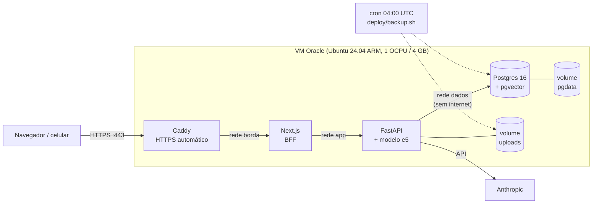

# Deploy

Fase 6, parte 3. Produção numa VM **grátis** da Oracle Cloud (Always Free, região São
Paulo), para uso pessoal. Tudo roda num `docker compose` só, o mesmo modelo do
desenvolvimento.

## 1. Por que esta hospedagem

Requisitos medidos: o backend usa cerca de **910 MB de RAM** com o modelo de embeddings
carregado (a imagem tem 1,8 GB por causa do torch). Somam-se o Postgres com pgvector,
disco persistente para os PDFs e um servidor Node para o Next, porque o BFF não roda como
site estático. Em resumo: uma máquina de 2 GB no mínimo.

Opções comparadas em out/2026 (preços mudam; confira antes):

| | Custo | RAM | Problema |
|---|---|---|---|
| **Oracle Always Free, São Paulo** (escolhida) | R$ 0 | até 12 GB ARM | regras mudam sem aviso; VM "ociosa" pode ser recuperada; cartão no cadastro |
| VPS no Brasil (Hostinger KVM 2) | ~R$ 44/mês em contrato de 24 meses | 8 GB | pago; servidor administrado por você |
| Vercel + Railway + Neon | ~US$ 10–15/mês | paga por GB | 3 painéis; banco grátis de 0,5 GB; sem região no Brasil |
| Hetzner (CAX11) | €5,99/mês | 4 GB | restringindo servidores novos desde abr/2026; Europa |
| Render | US$ 25/mês (2 GB) | 2 GB | caro para o projeto |

O critério do autor foi **grátis e só para uso pessoal**. A alternativa mais segura seria
rodar no próprio Mac com Tailscale (sem nada exposto na internet). A Oracle ganhou por ser
um deploy de verdade, sempre ligado e acessível de qualquer lugar.

### Os riscos da Oracle e o que fazer com eles

- **VM "ociosa" é recuperada.** A Oracle pode recuperar uma VM Always Free que fique 7 dias
  com CPU, rede **e** memória abaixo de 20% (a memória conta só nas VMs ARM). Um app pessoal
  fica quase sempre abaixo de 20% de CPU e de rede, então a **memória** é o que segura a VM.
  Medido na pilha de produção (seção 8): uns 1,05 GB nos containers com o modelo
  carregado, uns 1,4 GB com o sistema. Em 12 GB isso dá 12% (ociosa); em 6 GB, 23% (no
  limite). **Crie a VM com 1 OCPU e 4 GB:** cerca de 35% de uso, e ainda sobram 2,5 GB
  (mais 2 GB de swap para o build).
- **As regras mudam.** Em 2026 a Oracle cortou o limite grátis pela metade (de 4 OCPU/24 GB
  para 2/12) sem anúncio, e desligou as VMs acima do novo limite. A defesa é não depender
  da VM: backup diário puxado para fora (seção 5), e o mesmo `docker compose` sobe em
  qualquer outra VPS em minutos.
- **"Out of host capacity" ao criar a VM:** a região não tem VM ARM livre naquele momento.
  Tente outro *availability domain* ou outro horário.

## 2. Arquitetura



- Só o **Caddy** publica portas (80/443). A API e o banco não têm porta aberta; a API só é
  alcançada pelo Next. O `/docs` do FastAPI, por exemplo, não existe para a internet.
- **Três redes Docker**, cada serviço só nas que precisa (menor privilégio também na
  rede). A rede `dados` é `internal`: o Postgres nem consegue sair para a internet.
- O backend roda como usuário sem privilégios (uid 10001), sem `--reload` e sem as
  ferramentas de desenvolvimento.
- **X-Forwarded-For:** sem `trusted_proxies`, o Caddy ignora o `X-Forwarded-For` que vem
  da internet e escreve o IP real da conexão. O Next repassa esse IP à API, que só aceita
  com o `BFF_SEGREDO` (ver `frontend.md`). Isso fecha o ponto que ficou da sessão 2.

## 3. Variáveis de ambiente (nunca no código)

O `.env` de produção é **gerado no servidor** por `deploy/gerar-env.sh`: cada segredo sai
de `openssl rand -hex 32` ali mesmo, com permissão 600. Ele nunca passa por chat, e-mail ou
git. Quem vê o quê:

| Variável | db | backend | frontend | Caddy |
|---|---|---|---|---|
| `POSTGRES_*` (dono) | sim | via `MIGRATION_DATABASE_URL` | não | não |
| `DATABASE_URL` (papel da app) | não | sim | não | não |
| `JWT_SECRET` | não | sim | não | não |
| `BFF_SEGREDO` | não | sim | sim | não |
| `ANTHROPIC_API_KEY` | não | sim | não | não |
| `DOMINIO` | não | não | não | sim |

O frontend recebe só `BACKEND_URL` e `BFF_SEGREDO` (`environment:` explícito, sem
`env_file`): ele não precisa das senhas do banco, então não as vê.

## 4. Passo a passo (tarefas manuais)

Os passos 1 a 5 são no navegador e no seu Mac; o resto é no servidor. Eu não crio contas
nem digito cartão ou senha por você.

**1. Conta na Oracle Cloud.** Em oracle.com/cloud/free, crie a conta Free Tier. Escolha
**Brazil East (São Paulo)** como *home region*: ela não muda depois, e o Always Free só
vale nela. O cartão é só verificação; nada é cobrado dentro dos limites grátis.

**2. Chave SSH no Mac** (para entrar na VM):

```bash
ssh-keygen -t ed25519 -f ~/.ssh/oracle_estuda_ai -C "estuda-ai oracle"
```

**3. Criar a VM** (Compute → Instances → Create instance):

- imagem **Canonical Ubuntu 24.04** (aarch64);
- *shape* **VM.Standard.A1.Flex** (Ampere), **1 OCPU e 4 GB** de memória (ver seção 1);
- *boot volume* de 50 GB (o padrão);
- em "Add SSH keys", cole o conteúdo de `~/.ssh/oracle_estuda_ai.pub`;
- anote o **IP público** da VM.

**4. Liberar 80 e 443 na rede da Oracle.** Em Networking → Virtual Cloud Networks → a VCN
da VM → Security Lists → Default → *Add Ingress Rules*: origem `0.0.0.0/0`, TCP, porta de
destino `80`; repita para `443`. (O firewall do Ubuntu é a segunda camada; o script do
passo 7 abre as portas nele.)

**5. Domínio grátis.** Em duckdns.org (login com GitHub), crie um subdomínio, por exemplo
`meu-estuda-ai.duckdns.org`, e aponte para o IP público da VM. O Caddy precisa do domínio
para emitir o certificado HTTPS.

**6. Entrar na VM e clonar o repositório** (que é privado). Uma *deploy key* dá acesso de
leitura a este repositório e a nada mais:

```bash
ssh -i ~/.ssh/oracle_estuda_ai ubuntu@IP_DA_VM
```

```bash
ssh-keygen -t ed25519 -f ~/.ssh/github_estuda_ai -N "" -C "deploy estuda-ai"
```

```bash
printf 'Host github.com\n  IdentityFile ~/.ssh/github_estuda_ai\n' >> ~/.ssh/config
```

```bash
cat ~/.ssh/github_estuda_ai.pub
```

Cole essa chave pública no GitHub: repositório → Settings → Deploy keys → Add deploy key,
**sem** marcar "Allow write access". Depois:

```bash
git clone git@github.com:bergols/estuda-ai.git && cd estuda-ai
```

**7. Preparar o servidor** (Docker, firewall, atualizações automáticas, swap, SSH só com
chave, backup diário):

```bash
sudo deploy/preparar-servidor.sh
```

Saia e entre de novo no SSH (para o grupo `docker` valer).

**8. Gerar o `.env` de produção e subir:**

```bash
cd estuda-ai && deploy/gerar-env.sh meu-estuda-ai.duckdns.org
```

```bash
docker compose -f docker-compose.prod.yml up -d --build
```

A primeira subida leva uns 10 a 15 minutos (build das imagens; o torch é grande). Depois,
baixe o modelo de embeddings uma vez (~470 MB, fica no volume `modelos`):

```bash
docker compose -f docker-compose.prod.yml exec backend python -m app.servicos.embeddings
```

**9. Criar a sua conta** (a senha é pedida duas vezes, sem aparecer na tela):

```bash
docker compose -f docker-compose.prod.yml exec backend python -m scripts.criar_usuario --email voce@exemplo.com --nome "Seu nome"
```

**10. Ligar a IA (opcional).** Edite o `.env` (`nano .env`), descomente `ANTHROPIC_API_KEY=`
e cole a chave. Depois:

```bash
docker compose -f docker-compose.prod.yml up -d backend
```

**11. Pronto.** Abra `https://meu-estuda-ai.duckdns.org` no celular. "Adicionar à tela de
início" deixa o app com cara de aplicativo.

## 5. Backup e restore

### O que é feito

`deploy/backup.sh` roda todo dia às 04:00 UTC (cron instalado pelo
`preparar-servidor.sh`) e grava em `~/backups`:

- `banco_<data>.dump`: `pg_dump --format=custom`. O `pg_dump` lê uma **foto consistente**
  do banco (uma transação `REPEATABLE READ`), então a API pode continuar escrevendo durante
  o backup. O formato *custom* é comprimido e deixa o `pg_restore` escolher o que restaurar
  e em que ordem. O script confere o arquivo com `pg_restore --list` antes de dar o nome
  final: um dump cortado no meio nunca parece válido.
- `uploads_<data>.tar.gz`: os PDFs (o banco guarda só o caminho deles).
- Retenção de 14 dias (`RETENCAO_DIAS`).

### Levar o backup para fora do servidor

Um backup que fica na mesma VM não protege do caso mais provável aqui, que é perder a VM.
Do seu Mac, de vez em quando (ou num agendamento do macOS):

```bash
rsync -av -e "ssh -i ~/.ssh/oracle_estuda_ai" ubuntu@IP_DA_VM:backups/ ~/estuda-ai-backups/
```

### Restaurar

```bash
deploy/restaurar.sh ~/backups/banco_20261008T040000Z.dump ~/backups/uploads_20261008T040000Z.tar.gz
```

O script pede confirmação, para a API e o Next, e garante que o papel `estuda_ai_app`
existe. **Papéis são do servidor, não do banco: o `pg_dump` não os leva**, e num servidor
novo os `GRANT`s do dump falhariam. Depois ele restaura com `--clean --if-exists
--single-transaction` (tudo ou nada: se falhar no meio, o banco antigo fica intacto), volta
os PDFs e sobe tudo de novo. Ao subir, o backend aplica as migrations que faltarem e dá ao
papel a senha do `.env`.

Para migrar de servidor (a Oracle mudou as regras, por exemplo): numa VM nova, siga os
passos 6 a 8, copie o último backup para ela e rode o `restaurar.sh`.

### Testado

Toda a pilha de produção foi testada no Mac (ARM, como a VM) antes do deploy: subida,
login pelo HTTPS do Caddy, API sem porta exposta, backup, apagar dados de propósito,
restore e conferência das contagens. Os resultados estão na seção 8.

### O que este backup não cobre

Ele pode perder até **24 horas** (o intervalo entre backups; o nome técnico é RPO,
*recovery point objective*). Para reduzir isso a minutos, o caminho é o arquivamento
contínuo do WAL (`archive_mode` + `pg_basebackup`, ou ferramentas como pgBackRest/WAL-G),
que permite restaurar para qualquer instante (PITR). Para um app pessoal, o diário basta.
Fica como exercício (`exercicios.md`, 6.5).

## 6. Atualizar

Depois de dar push no `main`, no servidor:

```bash
deploy/atualizar.sh
```

Ele faz backup **antes** (uma migration nova mexe no schema), `git pull --ff-only`,
rebuild, sobe e limpa as imagens velhas (cada uma tem GBs por causa do torch). As
migrations rodam sozinhas quando o backend sobe.

## 7. Operação

```bash
docker compose -f docker-compose.prod.yml ps                 # estado dos serviços
docker compose -f docker-compose.prod.yml logs -f backend    # logs
docker stats --no-stream                                     # memória de cada um
tail ~/backups/backup.log                                    # último backup
docker system df                                             # disco usado pelo Docker
```

O certificado HTTPS renova sozinho (o Caddy cuida disso). Os certificados ficam no volume
`caddy_dados`: não apague, porque o Let's Encrypt limita quantos certificados um domínio
pode emitir por semana.

## 8. Resultados do teste local

A pilha de produção foi testada no Mac (ARM, como a VM), numa cópia do repositório, com o
`.env` gerado pelo `gerar-env.sh` e `DOMINIO=localhost` (o Caddy usa uma CA local):

| Verificação | Resultado |
|---|---|
| Migrations + `papel_app` na subida | ok, do zero até a última migration |
| Processo da API | `uid=10001(app)`, não root |
| `https://.../login` | 200, com HSTS, `nosniff`, `X-Frame-Options: DENY`, sem `Server` |
| `http://` | 308 para `https://` |
| Portas 8000 (API) e 5432 (banco) no host | conexão recusada |
| Banco saindo para a internet | "Network is unreachable" (rede `internal`) |
| API saindo para a internet (Anthropic, Hugging Face) | ok |
| Variáveis visíveis no container do Next | só `BACKEND_URL` e `BFF_SEGREDO` |
| Login pelo BFF com `X-Forwarded-For: 9.9.9.9` forjado | 200; o limite de login registrou o IP da conexão, não o 9.9.9.9 nem o do container do Next |
| `POST` com `Sec-Fetch-Site: cross-site` | 403 |
| `/api/disciplinas/%2E%2E/docs` (sem normalizar) | 404 |
| Backup → `DELETE FROM usuarios` → restore | 1 usuário e 1 disciplina de volta |
| Restore num "servidor novo" (`down -v` e `up` do zero) | dados de volta; `estuda_ai_app` só com `SELECT, INSERT` em `geracoes`; função `SECURITY DEFINER` presente; login pelo HTTPS ok; refresh da MV ok |
| Memória com o modelo carregado | backend 961 MB, Next 41 MB, Postgres 35 MB, Caddy 13 MB |

Dois achados do teste:

- **O `docker compose exec` lê o stdin.** Rodado de dentro de um heredoc, o `pg_dump` do
  `backup.sh` engolia o resto do script de teste. No cron não aconteceria (stdin vazio),
  mas os scripts agora passam `</dev/null` em todo `exec` sem entrada própria.
- **A primeira busca semântica depois de subir demora** (13 s no teste): é o modelo sendo
  carregado no processo da API. As seguintes são rápidas.

Localmente o IP registrado foi o gateway do Docker (`172.19.0.1`), porque a conexão vinha
do próprio Mac pelo encaminhamento do Colima. Na VM, uma conexão externa chega ao Caddy
com o IP real do cliente (as portas publicadas pelo Docker usam DNAT, que preserva a
origem).
