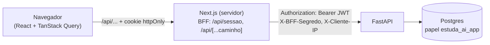

# Frontend

Fase 6, parte 2. Next.js 16 (App Router) + TypeScript + Tailwind 4 + TanStack Query +
Recharts, em `frontend/`. O que cada peça faz e **por quê**. A parte de segurança do
backend está em [`seguranca.md`](seguranca.md); aqui fica a do navegador.



## 1. Onde fica o token: BFF com cookie httpOnly

A API autentica com JWT no header `Authorization`. A pergunta é onde o navegador guarda
esse token. Duas opções foram comparadas:

| | `localStorage` | Cookie `httpOnly` + BFF (escolhido) |
|---|---|---|
| Quem lê o token | qualquer JavaScript da página | ninguém no navegador; só o servidor do Next |
| Um XSS (script injetado) | lê e leva o login por 30 dias | faz chamadas enquanto a aba está aberta, mas não leva o token |
| CSRF | não existe (o token não vai sozinho) | existe (o cookie vai sozinho): precisa de defesa |
| Custo | só CORS na API | um proxy no Next e o repasse do IP |

**BFF** ("backend for frontend"): o navegador só conversa com o servidor do Next, nunca
direto com a API.

- `POST /api/sessao` recebe e-mail e senha, chama `POST /auth/login` da API e grava o JWT
  num cookie `httpOnly; SameSite=Lax; Secure` (o `Secure` só em produção: em
  `http://localhost` o navegador recusaria o cookie). O token **não** volta no corpo da
  resposta. `DELETE /api/sessao` apaga o cookie.
- `/api/[...caminho]` repassa as outras chamadas, acrescentando `Authorization: Bearer`
  a partir do cookie. Se a API responder 401 (token expirado ou revogado pelo "sair de
  todos"), o BFF apaga o cookie e o cliente volta ao login.
- `src/proxy.ts` (o antigo "middleware", renomeado no Next 16) só confere se o cookie
  **existe** antes de renderizar uma página, e manda para `/login` se não existir. É uma
  checagem otimista: quem garante o acesso é a API, que valida o JWT em toda chamada.

Conferido no navegador: `document.cookie` não mostra o cookie da sessão.

### CSRF

Com cookie, um site malicioso pode tentar fazer o navegador da vítima mandar um `POST`
para cá (o cookie iria junto). Duas camadas:

1. `SameSite=Lax`: o navegador não envia o cookie em `POST`/`PATCH`/`DELETE` disparados
   por outro site (só em navegação de primeiro nível, como clicar num link, que é `GET`).
2. `Sec-Fetch-Site`: navegadores modernos dizem de onde veio cada requisição. O BFF
   recusa mutações com valor diferente de `same-origin` (`origemConfiavel` em
   `lib/bff.ts`).

As rotas `GET` da API não mudam nada, então ler de outro site não causa estrago (e a
resposta não pode ser lida por outro site, por causa da política de mesma origem).

### O BFF não é um proxy aberto

`/api/[...caminho]` só repassa caminhos de uma **allowlist** (`disciplinas`, `revisoes`,
`analytics`, `gastos`, `auth/eu`, `auth/sair-de-todos`). O login não está nela: ele tem
rota própria, que é a única que grava o cookie.

**Bug encontrado pelos testes.** A primeira versão conferia só o primeiro segmento.
`/api/disciplinas/../docs` passava (o primeiro segmento é `disciplinas`), e a URL
montada para a API resolvia para `/docs`. Ou seja, qualquer rota da API ficava
alcançável pelo proxy, com o JWT anexado. O navegador normaliza o `..` antes de enviar,
mas um atacante não usa navegador (`curl --path-as-is`). Codificar também não resolve:
pelo padrão WHATWG de URL, `%2E%2E` **também** é `..`. A correção recusa `.`, `..` e
segmentos vazios em qualquer posição. Os testes ficam em `lib/bff.test.ts` (Vitest), e
um deles documenta o comportamento do `%2E%2E` que motivou a regra.

### O IP do cliente atrás do BFF

Com o BFF no meio, **toda** requisição chega à API vinda do IP do servidor do Next. O
limite de login por IP (fase 6, parte 1) passaria a valer para todo mundo junto: 20
tentativas erradas de qualquer pessoa bloqueariam todas as outras.

O Next repassa o IP real em `X-Cliente-IP`. Mas confiar num header que o cliente pode
escrever é o erro clássico: um atacante mandaria um IP diferente a cada tentativa e o
limite sumiria. Por isso a API só aceita o header quando vem junto com `X-BFF-Segredo`,
um segredo compartilhado (`BFF_SEGREDO`, o mesmo nos dois `.env`), comparado com
`hmac.compare_digest` (tempo constante), e o valor precisa ser um IP válido
(`ipaddress.ip_address`). Sem segredo, ou com segredo errado, vale o IP da conexão. Os
testes em `backend/tests/test_limites.py` cobrem os quatro casos.

De onde o Next tira o IP: o primeiro item do `X-Forwarded-For`, que a plataforma de
hospedagem escreve na borda. Em qual plataforma ele é confiável é uma pergunta da
sessão de deploy.

## 2. Contrato tipado: tipos gerados do OpenAPI

O FastAPI já descreve a API inteira em OpenAPI (`/openapi.json`). Em vez de reescrever
os tipos à mão no frontend (e eles divergirem em silêncio), o contrato é **gerado**:

```bash
docker compose exec -T backend python -m scripts.exportar_openapi > frontend/openapi.json
npm --prefix frontend run tipos      # openapi-typescript -> src/lib/api-schema.d.ts
```

O cliente (`openapi-fetch`) usa esses tipos: caminho, parâmetros e corpo de cada chamada
são conferidos pelo TypeScript. Uma rota ou um campo que mudar no backend quebra o
`npm run typecheck`. O CI confere as duas pontas: o job do backend exporta de novo e
compara com o `openapi.json` commitado; o do frontend regenera os tipos e compara.

O contrato também ensinou o backend. `MaterialLer.status` era `str` e virou
`Literal["pendente", "processando", "concluido", "erro"]` (o mesmo conjunto do CHECK no
banco). O OpenAPI passou a ter um `enum`, e o frontend um tipo com os quatro estados.

Decimais (`Decimal` no Python, `numeric` no Postgres) chegam como **string** no JSON,
para não perder precisão num `float`. O frontend converte com `Number()` só na hora de
mostrar.

## 3. Dados no cliente: TanStack Query

Todas as telas buscam dados no navegador (componentes cliente). O TanStack Query cuida
do que seria repetitivo:

- **Cache por chave** (`chaves` em `lib/consultas.ts`), hierárquica:
  `["disciplinas", 5, "materiais"]`. Uma mutação invalida exatamente o que mudou:
  gerar flashcards invalida a lista, a fila do dia e os gastos.
- **Polling condicional:** depois do upload (202), a lista de materiais é consultada a
  cada 2 s **só enquanto** algum material está `pendente` ou `processando`.
- **A fila de revisão é uma foto** (`staleTime: Infinity`, sem refetch ao voltar para a
  aba). Se ela recarregasse no meio da sessão, os cards já revisados sumiriam da lista e
  a posição embaralharia.
- **Sem piscar no filtro:** no painel, trocar a disciplina mantém o gráfico anterior
  esmaecido (`keepPreviousData`) até os dados novos chegarem.
- **Não tenta de novo o que não vai melhorar:** erros 4xx (404, 422, 429) não são
  repetidos; 5xx e rede, até 2 vezes.

### Concorrência na revisão (o 409 da fase 4)

A nota vai com a `versao` que veio na fila (controle otimista). Se o mesmo card foi
revisado em outra aba depois que a fila foi montada, a API responde 409 e não grava
nada. A tela avisa e passa para o próximo card. Testado revisando o card "por fora" no
meio de uma sessão.

## 4. Next 16: Cache Components e `<Suspense>`

O projeto usa `cacheComponents` (padrão no Next 16). Com ele, o Next pré-renderiza o
"esqueleto" estático de cada página e só espera a requisição para o que depende dela.
A regra: **quem lê a URL** (`usePathname`, `useParams`) fica dentro de um `<Suspense>`,
senão o Next acusa erro. Por isso:

- a navegação desenha os links sem destaque (fallback) e o destaque do link ativo chega
  depois;
- o topo da disciplina e o conteúdo das abas ficam em `<Suspense>` com um esqueleto do
  mesmo tamanho (nada pula de lugar).

Armadilha encontrada no CI: `LayoutProps`, `PageProps` e `RouteContext` são tipos
**globais gerados** pelo Next em `.next/types`. Localmente a pasta já existia; no CI o
`tsc` rodou antes de qualquer geração. Por isso o script é `next typegen && tsc --noEmit`.

## 5. Visual e acessibilidade

- **"Caderno":** papel quente, fios separando as seções em vez de cartões, um acento
  vinho, títulos com serifa (Source Serif 4) e o resto em sans do sistema. Sem sombras,
  pílulas nem grades de cartões iguais.
- **Modo escuro "papel noturno"** (escuro quente, não preto azulado). Segue o sistema por
  padrão; o botão alterna sistema → claro → escuro. Um script inline no `<head>` aplica o
  tema salvo **antes da primeira pintura**. Com `useEffect`, a página apareceria clara e
  depois escureceria.
- **Celular:** a navegação vira uma barra fixa embaixo (alcance do polegar), as abas da
  disciplina rolam na horizontal, e o calendário do painel rola a partir dos dias
  recentes.
- **Estados:** todo dado tem os estados carregando, erro (com "tentar de novo") e vazio.
  Um 429 mostra quanto tempo falta (`Retry-After`); um 502 do LLM mostra o motivo que a
  API deu; um 500 fica genérico.
- **Teclado:** foco sempre visível; na revisão, espaço vira o card e 0 a 5 dão a nota.

### Fórmulas (KaTeX)

Cards, questões, alternativas, explicações, a revisão do dia, as respostas do Perguntar e
os cards difíceis do painel aceitam LaTeX: `$x^2$` no meio da frase, `$$...$$` ou `\[...\]`
em destaque, `\(...\)` inline (`components/texto-rico.tsx`). Os trechos dos PDFs (busca e
fontes) continuam texto puro: são o material como foi extraído.

- **O cifrão do real.** "R$ 10" e "US$ 5" não podem virar fórmula. `lib/formulas.ts` usa
  as regras do pandoc (o `$` que abre não tem espaço depois; o que fecha não tem espaço
  antes nem número depois) e mais uma: o `$` colado depois de letra ou número (R$, US$)
  nunca abre fórmula. `\$` é um cifrão literal. Os testes cobrem os casos de dinheiro.
- **Segurança.** A saída do KaTeX entra com `dangerouslySetInnerHTML`, então a configuração
  é a defesa: `trust: false` desliga `\href`, `\url`, `\includegraphics` e `\html*`, e o KaTeX
  escapa o resto. Testado: `\href{javascript:...}` não vira link, e `` sai
  como texto escapado. Um material ou uma resposta maliciosa não injeta HTML na página.
- **Erro de LaTeX** aparece em vermelho, com o código, em vez de quebrar a tela
  (`throwOnError: false`).
- Os prompts da geração (API) pedem fórmulas nesse formato; o mesmo vale para o conteúdo
  escrito pelo Claude Code (`CLAUDE.md`).

### Gráficos

As formas foram escolhidas pelo **trabalho** de cada dado, não por variedade:

| Dado | Forma | Por quê |
|---|---|---|
| sequência, acerto da semana, cards para hoje | número solto | um gráfico de uma barra é só um número com mais tinta |
| acerto por dia | linha de **ênfase**: média de 7 dias em destaque, taxa do dia em cinza | o dia a dia é ruidoso; a tendência é a história |
| revisões no ano | mapa de calor em **um tom** (claro → escuro) | magnitude, não identidade: uma cor só |
| cards vencendo nos próximos 30 dias | colunas | comparar quantidades por dia |
| cards mais difíceis, custos | **tabela** | lista ranqueada e valores exatos não são gráfico |

Regras seguidas: um eixo só, marcas finas (linha de 2 px, colunas até 24 px), grade em
fio sólido recessivo e marcas do eixo "redondas" (0, 100, 200). O texto nunca vai na cor
da série; a legenda usa um traço da cor. A variação semanal leva seta e sinal, não só
cor. Todo gráfico tem a **tabela equivalente** ("ver como tabela"), e o tooltip
acrescenta informação, mas nunca é o único jeito de ler um valor. Dias sem estudo
aparecem como buraco na linha, não como zero, porque zero seria mentira.

As cores dos gráficos foram **validadas com um script** (contraste e separação para
daltonismo), não no olho:

- **Claro:** vinho `#8c2f27` e cinza `#8f8a80` passam.
- **Escuro:** o vinho do texto (`#e08a7c`) era claro demais para marcas e foi trocado por
  `#d4705f`. Esse vinho ficava perto demais do cinza para quem tem protanopia, então o
  cinza de contexto desceu para `#5a554d`, separando pela luminosidade. O contraste dele
  ficou em 2,3:1, abaixo de 3:1. É aceitável só porque é contexto recessivo **e** todo
  gráfico tem a tabela.

## 5b. Dois alvos: web e desktop (fase 7)

O mesmo código compila para a web (Vercel, com BFF) e para o app desktop (exportação
estática dentro do Tauri). O que muda:

- `ALVO=desktop` no `next.config.ts`: `output: "export"`, sem Cache Components (PPR exige
  servidor), `distDir: "out"`, `tsconfig.desktop.json` próprio;
- arquivos só da web terminam em `.web.ts` (`route.web.ts`, `proxy.web.ts`): a web os
  reconhece por `pageExtensions`, e o desktop os ignora;
- disciplina pela query string (`/disciplina?id=5`), porque a exportação não gera páginas
  para ids que só existem no banco;
- `lib/plataforma.ts` (`DESKTOP`) escolhe, em tempo de build, o `fetch` do cliente tipado:
  o do navegador (BFF com cookie) ou o da ponte para o Rust (`lib/desktop.ts`), que
  acrescenta o token guardado no cofre do sistema.

Detalhes e o porquê em [`modo-foco.md`](modo-foco.md), seções 2 e 3.

## 6. Testes e CI

- `npm test` (Vitest): as regras de segurança do BFF (allowlist, CSRF, IP), como
  funções puras.
- `npm run lint` (inclui as regras do React Compiler: ele recusou `Date.now()` durante a
  renderização; o tempo de resposta das questões usa o `timeStamp` do evento de clique).
- `npm run typecheck` e `npm run build`.
- O CI roda tudo isso a cada push, mais a conferência dos tipos gerados do OpenAPI.

Os fluxos ponta a ponta (login, upload, busca, perguntar, revisão com 409, sair de
todos) foram conferidos no navegador, nos modos claro e escuro e em largura de celular.
Teste automatizado de ponta a ponta (Playwright) fica como próximo passo.

## Rodar

```bash
cp frontend/.env.example frontend/.env.local   # BACKEND_URL e o mesmo BFF_SEGREDO do .env
npm --prefix frontend install
npm --prefix frontend run dev                  # http://localhost:3000
```

Conta de demonstração local, com dados de 6 semanas:

```bash
docker compose exec backend python -m scripts.seed_revisoes --senha-dev
```

Ela entra como `estudante@estuda-ai.local`, com a senha `SENHA_DEV` do script. Essa senha
é **pública** (está no código), então só serve para o banco local.
