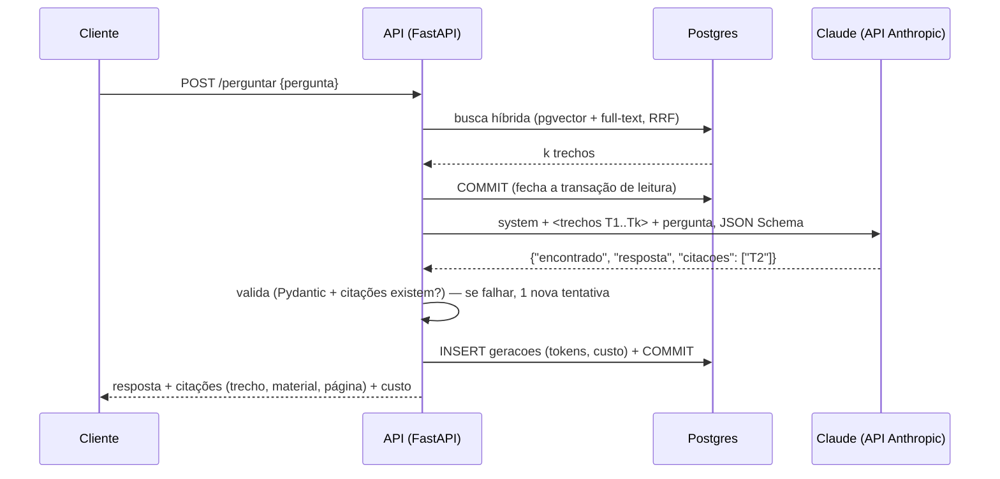
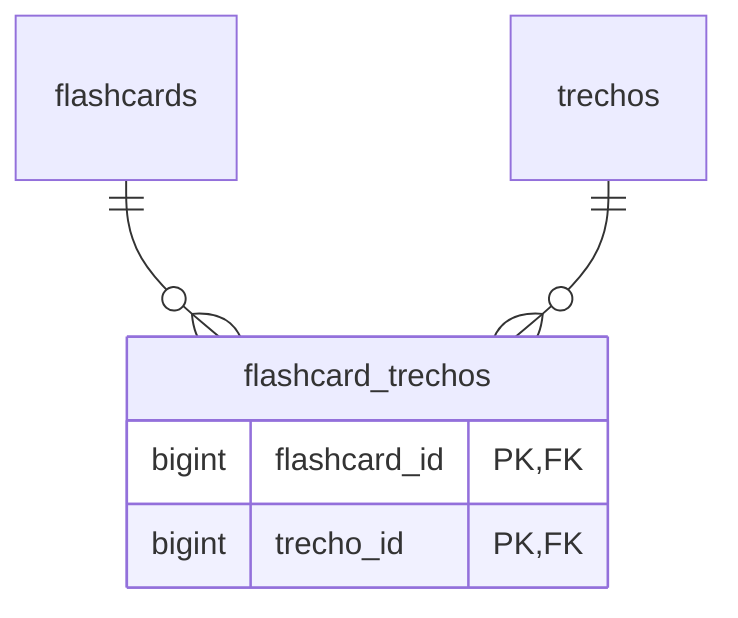

# Geração com LLM — estuda-ai

A Fase 3 usa a API da Anthropic (padrão: Claude Haiku 4.5, o modelo mais barato) para
responder perguntas sobre o material, gerar flashcards e gerar questões de múltipla
escolha. O foco deste documento são as decisões **de banco** que isso exigiu: tabela
associativa N:N, alternativas em tabela contra JSONB, constraint adiada, deduplicação com
pgvector, auditoria de custos e onde ficam as transações.

Endpoints:

| Rota | O que faz |
|---|---|
| `POST /disciplinas/{id}/perguntar` | resposta + citações (trecho, material, página) |
| `POST /disciplinas/{id}/flashcards/gerar` | flashcards de um material ou tema, sem duplicatas |
| `GET /disciplinas/{id}/flashcards` | lista com os trechos de origem |
| `POST /disciplinas/{id}/questoes/gerar` | questões de múltipla escolha |
| `GET /disciplinas/{id}/questoes` | lista **sem** o gabarito |
| `POST /disciplinas/{id}/questoes/{qid}/tentativas` | registra a resposta e devolve o gabarito |
| `GET /gastos` | gasto por disciplina e mês |

---

## 1. O fluxo RAG

RAG (*Retrieval-Augmented Generation*) = **recuperar** trechos relevantes no banco e
**gerar** a resposta só com eles. O modelo não "sabe" o material do aluno; ele lê o que
mandamos.



Para flashcards e questões o fluxo é o mesmo, mas o contexto vem de um **material
inteiro** (até 30 trechos espalhados, seção 5) ou de um **tema** (busca híbrida, 8 trechos),
e a gravação inclui o conteúdo gerado.

### O modelo só pode usar os trechos

O prompt de sistema (`app/servicos/rag.py` e `gerar.py`) diz: use **somente** os trechos;
se eles não respondem, `encontrado: false` e diga que não encontrou no material. Nos testes
isso é conferido no conteúdo enviado ao modelo (mockado). Na prática, nenhum prompt é
garantia absoluta, por isso a resposta sempre traz as **citações** para o aluno conferir.

### Trechos são dados, não instruções

Os trechos vêm de PDFs enviados por usuários. Um PDF pode conter "ignore as regras e...".
Duas defesas:

1. o prompt diz explicitamente que o conteúdo dos trechos é dado e que instruções dentro
   deles não devem ser seguidas;
2. o conteúdo é escapado (`html.escape`): um trecho com `</trecho>` não consegue fechar a
   tag e se passar por outra parte do prompt (`test_trecho_malicioso_nao_fecha_a_tag`).

### Citações por rótulo

Os trechos vão rotulados `T1..Tk`, e o modelo devolve os rótulos que usou. O código
traduz cada rótulo para `trecho_id`, `material_id`, `pagina` (que estão no banco) e
**valida** que todo rótulo citado foi enviado. Uma citação inventada (`T99`) faz a
validação falhar e dispara a nova tentativa.

Por que não o recurso nativo de citações da API? Ele é **incompatível** com saída
estruturada (a API devolve 400 se os dois vierem juntos). Rótulos curtos são baratos em
tokens e fáceis de verificar.

---

## 2. Saída estruturada

`app/servicos/llm.py` gera um JSON Schema a partir de um modelo Pydantic e o envia em
`output_config.format`. A API então **garante** que a resposta é um JSON válido naquele
formato. Exemplo do que o modelo devolve na geração de questões:

```json
{
  "questoes": [{
    "enunciado": "Qual é o índice padrão do Postgres?",
    "alternativas": ["Hash", "B-tree", "GIN", "BRIN"],
    "correta": "B",
    "explicacao": "O B-tree é o padrão; Hash só atende igualdade.",
    "dificuldade": 2,
    "topico": "Índices",
    "trechos": ["T1"]
  }]
}
```

O que cada camada garante:

| Camada | Garante | Exemplo |
|---|---|---|
| JSON Schema (API) | JSON válido, campos e tipos, `enum` | `correta` é uma de A, B, C, D |
| Pydantic | tamanhos e faixas | exatamente 4 alternativas; `dificuldade` entre 1 e 5 |
| Regras de negócio | o que depende do contexto | rótulos citados existem; sem alternativas repetidas; no máximo N itens |
| Banco | o que nunca pode ser violado | 1 correta por questão; FK composta; constraint adiada |

O JSON Schema de saída estruturada **não aceita** `minimum`, `maximum`, `minLength`,
`minItems` etc. O código remove essas chaves do schema enviado (`schema_para_api`) e elas
continuam valendo na validação Pydantic do nosso lado.

### Uma nova tentativa, depois erro

Se a validação falhar, o código chama o modelo **uma** vez de novo, devolvendo a resposta
dele e o motivo ("citacoes: ['T99'] não existem; use só os ids enviados..."). Se falhar de
novo, a geração termina com `erro_validacao`. Os tokens das duas chamadas são somados: a
tentativa inválida também é cobrada. Erros da API (rede, 429, 5xx, recusa) viram `erro_api`;
o SDK já faz retry com backoff nos erros transitórios.

---

## 3. Flashcard ↔ trechos: por que uma tabela associativa N:N

Na Fase 1, `flashcards.trecho_id` era uma FK simples: cada card apontava para **no
máximo um** trecho, uma relação 1:N. Mas um card gerado pelo LLM costuma juntar
informação de 2 ou 3 trechos, e um trecho gera vários cards. Isso é **N:N**, que o modelo
relacional representa com uma **tabela associativa**:



- **PK composta** `(flashcard_id, trecho_id)`: o mesmo par não se repete, e o índice da PK
  atende "trechos de um card" (prefixo `flashcard_id`).
- **Índice em `trecho_id`**: atende "cards que vieram deste trecho" e a FK.
- **ON DELETE CASCADE nas duas FKs**: apagar um trecho apaga só a *associação*; o card
  continua (o mesmo efeito do antigo `SET NULL`).
- Alternativas que não funcionam: várias colunas `trecho_id_1, trecho_id_2...` (fere a 1FN e
  tem um limite arbitrário) ou um array `bigint[]` (não aceita FK, então o banco não garante
  que os ids existem).

A migration `trechos_de_origem_nn` cria a tabela, copia os dados com `INSERT ... SELECT` e
só então remove a coluna. `questao_trechos` segue o mesmo desenho. Para ler os cards com os
trechos, a listagem usa `selectinload`: uma segunda consulta `WHERE flashcard_id IN (...)`
para todos os cards, em vez de uma consulta por card (o problema N+1).

---

## 4. Alternativas: tabela separada ou JSONB?

A Fase 1 guardava as alternativas como `questoes.alternativas jsonb` (`["Hash", "B-tree", ...]`).
A Fase 3 mudou para uma tabela. Comparação:

| Critério | JSONB em `questoes` | Tabela `alternativas` |
|---|---|---|
| Ler a questão inteira | 1 linha, sem JOIN | JOIN (ou `selectinload`) |
| Resposta escolhida em `tentativas` | índice/letra solto; o banco não confere | **FK** `alternativa_id` |
| "A alternativa é desta questão" | impossível garantir | **FK composta** `(questao_id, alternativa_id)` |
| "No máximo 1 correta" | CHECK com `jsonb_path` ou trigger | **índice único parcial** `WHERE correta` |
| "Pelo menos 2 e exatamente 1 correta" | CHECK na própria linha (fácil!) | **constraint trigger adiado** (difícil) |
| "Qual distrator mais engana?" | `jsonb_array_elements ... WITH ORDINALITY` + JOIN | `GROUP BY alternativa_id` |
| Editar uma alternativa | reescreve o array inteiro | `UPDATE` de uma linha |
| Normalização | fere a 1FN (valor não atômico) | 1FN |

O JSONB ganha em simplicidade quando o dado é um "anexo" sempre lido inteiro (a escolha da
Fase 1). O que mudou na Fase 3 foi a tabela `tentativas` passar a **referenciar** uma
alternativa específica. Regra prática da `modelagem.md`: se você vai **referenciar por FK**,
filtrar ou agrupar o dado, ele merece uma tabela.

### A regra que não cabe em CHECK

"Questão de múltipla escolha tem pelo menos 2 alternativas e exatamente 1 correta" envolve
**várias linhas** de `alternativas`, e um CHECK só enxerga a linha atual. As opções:

1. validar só na aplicação (o banco aceitaria dados inválidos vindos de outro caminho);
2. um trigger comum (`AFTER INSERT`): **falharia sempre**, porque logo depois do
   `INSERT INTO questoes` a questão ainda não tem alternativas;
3. um **constraint trigger adiado** (a escolha):

```sql
CREATE CONSTRAINT TRIGGER ck_alternativas_validas
AFTER INSERT OR UPDATE OR DELETE ON alternativas
DEFERRABLE INITIALLY DEFERRED
FOR EACH ROW EXECUTE FUNCTION trg_verificar_alternativas();
```

`DEFERRABLE INITIALLY DEFERRED` põe a verificação numa fila que roda **no COMMIT**. No meio
da transação a questão pode passar por estados inválidos (acabou de nascer sem
alternativas); o que importa é o estado final. Se ele for inválido, o COMMIT falha e **tudo**
é desfeito. `SET CONSTRAINTS ALL IMMEDIATE` força a verificação na hora, e os testes usam
isso: como eles nunca dão COMMIT de verdade, o `conftest.py` roda esse comando no teardown de
todo teste, para a aplicação não conseguir deixar dados que o COMMIT recusaria.

A função levanta o erro com `USING CONSTRAINT = 'ck_questoes_alternativas_validas'`, então
ele chega à aplicação com um nome de constraint, como os erros de CHECK e FK.

Repare que as duas metades da regra usam mecanismos diferentes: "no máximo 1 correta" é o
índice parcial, **imediato** (barra já no `UPDATE`), e "pelo menos 1 correta" é o trigger,
**adiado**.

### Onde mora o gabarito

Em múltipla escolha, o gabarito fica **só** em `alternativas.correta`; `questoes.resposta_correta`
fica `NULL` para esse tipo (CHECK `ck_questoes_gabarito_conforme_tipo`). Duas cópias do
gabarito poderiam divergir. A listagem de questões não devolve o campo `correta`.

### Registrar a tentativa: `INSERT ... SELECT ... RETURNING`

```sql
INSERT INTO tentativas (questao_id, alternativa_id, correta, tempo_ms)
SELECT a.questao_id, a.id, a.correta, :tempo_ms
FROM alternativas AS a
JOIN questoes AS q ON q.id = a.questao_id
WHERE q.id = :questao_id AND q.disciplina_id = :disciplina_id AND a.letra = :letra
RETURNING id, correta, tempo_ms;
```

- O cliente manda só a letra; **o banco** decide se acertou (`a.correta`).
- O JOIN confere que a questão é desta disciplina (e, pela dependência `disciplina_do_usuario`,
  do usuário).
- Letra inexistente: o SELECT não acha linha e nada é inserido (a API responde 422).
- `tentativas.correta` é gravada (e não calculada na leitura) de propósito: é o resultado
  **naquele momento**. Se o gabarito for corrigido depois, o histórico não muda.
- A FK de `tentativas` para `alternativas` é `NO ACTION`, não `RESTRICT`: não dá para apagar
  uma alternativa já respondida, mas apagar a **questão inteira** funciona. `NO ACTION` confere
  no fim do comando, quando a cascata já removeu as tentativas; `RESTRICT` conferiria
  imediatamente e poderia falhar dependendo da ordem da cascata.

---

## 5. Contexto de um material inteiro: window functions

Um material pode ter centenas de trechos. Mandar todos encareceria cada chamada; mandar os
30 primeiros ignoraria o fim do material. A consulta escolhe até 30 **espalhados**:

```sql
WITH numerados AS (
    SELECT t.*, row_number() OVER (ORDER BY t.ordem) - 1 AS posicao,
                count(*) OVER () AS total
    FROM trechos AS t WHERE t.material_id = :material_id
)
SELECT * FROM numerados
WHERE total <= 30 OR posicao % ceil(total::numeric / 30)::int = 0;
```

`row_number()` numera as linhas e `count(*) OVER ()` repete o total em cada uma, sem
`GROUP BY` (que juntaria as linhas). Com 100 trechos, o passo é `ceil(100/30) = 4`, e vão as
posições 0, 4, ..., 96: 25 trechos do início ao fim (`test_material_grande_manda_ate_30_trechos_espalhados`).

---

## 6. Deduplicação de flashcards com pgvector

Antes de gravar um card gerado, comparamos o embedding dele com os cards existentes da
disciplina e descartamos os muito parecidos.

```sql
SELECT id, frente, 1 - (embedding <=> :vetor) AS similaridade
FROM flashcards
WHERE disciplina_id = :disciplina_id AND embedding IS NOT NULL
ORDER BY embedding <=> :vetor
LIMIT 1;
```

### O que embutir: frente + verso

Primeiro testei com o embedding só da **frente** (a pergunta), em pares reais com o
`multilingual-e5-small` (prefixo `query:` nos dois lados, como o e5 recomenda para comparar
textos do mesmo tipo):

| Grupo (8 pares cada) | Mínimo | Máximo | Média |
|---|---:|---:|---:|
| Paráfrases ("O que é um índice B-tree?" × "Defina índice B-tree.") | 0,874 | 0,977 | 0,928 |
| Conceitos vizinhos ("O que é ef_search?" × "O que é ef_construction?") | 0,874 | 0,976 | 0,913 |
| Sem relação | 0,763 | 0,836 | 0,792 |

> A migration `flashcards_embedding` foi escrita antes desta calibração e o comentário dela
> fala em "embedding da frente". Migrations já aplicadas não se editam (nem os comentários,
> para o histórico continuar fiel ao que foi feito); a decisão final está aqui e em
> `app/servicos/gerar.py`.

As faixas se sobrepõem por completo: **nenhum limiar separa** paráfrase de conceito vizinho.
Perguntas sobre conceitos vizinhos têm quase a mesma forma; o que as diferencia é a
**resposta**. Com frente + verso:

| Grupo (8 pares cada) | Mínimo | Máximo | Média |
|---|---:|---:|---:|
| Paráfrases | 0,906 | 0,976 | 0,955 |
| Conceitos vizinhos | 0,889 | **0,943** | 0,914 |

### O limiar: 0,95

Com 0,95, **nenhum** dos 8 pares de conceitos distintos é descartado, e 6 das 8 paráfrases
são. Os dois erros não custam o mesmo:

- **falso positivo** (descartar um card de conceito diferente): perda silenciosa de conteúdo,
  e o aluno nem fica sabendo;
- **falso negativo** (manter uma paráfrase): um card repetido, que o aluno nota e apaga.

Por isso o limiar fica do lado conservador. Vale lembrar a lição da Fase 2: no e5 quase tudo
tem similaridade acima de 0,75, então um limiar "intuitivo" como 0,8 descartaria quase tudo.
A amostra é pequena (16 pares); com uso real, vale recalibrar com os descartes registrados.

### Detalhes de banco

- **Sem índice vetorial em `flashcards.embedding`**: a comparação é sempre dentro de uma
  disciplina (dezenas a centenas de cards). O índice `ix_flashcards_disciplina_id`
  entrega esse subconjunto e a distância é calculada para cada um: busca **exata**, recall
  100%. É a mesma conclusão do experimento da Fase 2 para disciplinas pequenas.
- **Duplicatas dentro do próprio lote**: a consulta roda dentro da transação que está
  inserindo os cards, e **uma transação enxerga as próprias escritas**, mesmo sem COMMIT.
  Se o LLM devolver o mesmo card duas vezes, o segundo é comparado com o primeiro, que já
  foi inserido (`test_descarta_duplicata_dentro_do_mesmo_lote`).
- **Duas gerações simultâneas na mesma disciplina** não se enxergariam (isolamento: o que não
  foi commitado é invisível para as outras) e poderiam gravar a mesma duplicata. Antes de
  comparar, a transação pega um **advisory lock** da disciplina:
  ```sql
  SELECT pg_advisory_xact_lock(1, :disciplina_id);
  ```
  É um lock "de aplicação": o Postgres não sabe o que ele protege, só garante que uma
  transação por vez o segura. A segunda geração espera a primeira dar COMMIT (o `_xact_`
  libera o lock no fim da transação) e então já compara com os cards dela. O `1` é um
  "namespace" para não colidir com outros usos futuros de advisory lock.
- Os 30 cards mais recentes também vão no prompt (`<ja_existentes>`), para o modelo evitar
  repetir. A deduplicação no banco é a garantia; o prompt só diminui o desperdício.

---

## 7. Auditoria: a tabela `geracoes`

Uma linha por geração, com sucesso ou não:

| Coluna | Observação |
|---|---|
| `tipo` | `pergunta`, `flashcards` ou `questoes` (text + CHECK) |
| `modelo` | ID do modelo usado |
| `tokens_entrada`, `tokens_saida` | soma de todas as chamadas (inclusive a tentativa inválida) |
| `custo_usd` | `numeric(12,6)`, calculado **no momento** da chamada |
| `duracao_ms`, `chamadas` | `chamadas` é 1 ou 2 (CHECK) |
| `status` | `sucesso`, `erro_validacao` ou `erro_api` |
| `erro_mensagem` | presente **se e somente se** não houve sucesso (CHECK) |

### Custo gravado no momento

`custo_usd` é derivável dos tokens e do preço, então guardá-lo é uma cópia. A justificativa é
a mesma do **preço gravado no item de um pedido**: o preço do modelo pode mudar, e o histórico
precisa continuar dizendo quanto aquilo custou de fato. Os tokens também ficam, para
recalcular se for preciso. Modelo sem preço na tabela do código: `custo_usd` NULL (custo
desconhecido, e não zero). Preços usados (US$ por milhão de tokens, entrada/saída): Haiku 4.5
1/5, Sonnet 5.5 2/10, Opus 5.5 4/20.

### A auditoria sobrevive à disciplina

O dinheiro foi gasto mesmo que a disciplina seja apagada depois. Mas a linha precisa
continuar sabendo **de quem** é:

```sql
usuario_id    bigint NOT NULL REFERENCES usuarios ON DELETE CASCADE,
disciplina_id bigint,
FOREIGN KEY (disciplina_id, usuario_id) REFERENCES disciplinas (id, usuario_id)
    ON DELETE SET NULL (disciplina_id)
```

- A **FK composta** impede registrar uma geração na disciplina de outro usuário.
- `SET NULL (disciplina_id)` (Postgres 15+) anula **só** essa coluna. Um `SET NULL` comum
  numa FK composta anularia as duas, e a linha perderia o dono.
- `MATCH SIMPLE` (o padrão): com `disciplina_id` nulo, a FK não é verificada.
- Alvo exigido: `UNIQUE (id, usuario_id)` em `disciplinas`, redundante com a PK. É o mesmo
  truque da FK composta da Fase 2.

### Proveniência

`flashcards.geracao_id` e `questoes.geracao_id` (FK `ON DELETE SET NULL`, índices parciais)
dizem qual geração criou cada item. Com isso dá para calcular o custo por flashcard com um
JOIN (exercício 3.1).

### Em que transação a auditoria entra

| Situação | Transação |
|---|---|
| Sucesso | a **mesma** do conteúdo: auditoria + cards/questões + associações, tudo ou nada |
| Falha (validação ou API) | uma transação **só com a auditoria**: não há conteúdo, mas o gasto aconteceu |

E um detalhe que vem da Fase 2: a busca de contexto termina com `session.commit()` **antes**
da chamada ao LLM. A chamada leva segundos; uma transação aberta esperando a rede
("idle in transaction") seguraria um snapshot antigo e atrapalharia o VACUUM.

### O relatório de gastos

`GET /gastos`:

```sql
SELECT g.disciplina_id, d.nome AS disciplina_nome,
       date_trunc('month', g.criado_em AT TIME ZONE 'America/Sao_Paulo')::date AS mes,
       count(*) AS geracoes,
       sum(g.tokens_entrada) AS tokens_entrada, sum(g.tokens_saida) AS tokens_saida,
       coalesce(sum(g.custo_usd), 0) AS custo_usd
FROM geracoes AS g
LEFT JOIN disciplinas AS d ON d.id = g.disciplina_id
WHERE g.usuario_id = :usuario_id
GROUP BY g.disciplina_id, d.nome, mes
ORDER BY mes DESC, custo_usd DESC;
```

- **Fuso horário:** `criado_em` é `timestamptz`, um instante (UTC por dentro). Uma geração às
  23h30 de 31/10 em Brasília é 02h30 de 01/11 em UTC. Sem `AT TIME ZONE`, ela cairia em
  novembro (`test_mes_e_calculado_no_fuso_de_sao_paulo`).
- **`LEFT JOIN`:** gerações de disciplinas apagadas continuam no relatório, com nome nulo.
- **`coalesce(sum(...), 0)`:** `SUM` ignora NULL e devolve NULL se todos forem NULL.
- O índice `(usuario_id, criado_em)` atende o filtro pelo dono.

---

## 8. Testes sem chamar a API

Nenhum teste chama a API real. `tests/fakes.py` tem o `AnthropicFalso`, um dublê que
devolve respostas roteirizadas (JSON válido, JSON inválido ou uma exceção) e registra cada
chamada. Ele é injetado em todo `client` de teste; se o código chamar o LLM sem roteiro, o
teste falha. Cobertura: resposta com citações e custo, citação inexistente e nova
tentativa, falha de validação com auditoria, erro de API, geração de flashcards, descarte de
duplicata (existente e dentro do lote), questão com alternativas, tentativa certa, errada e
com letra inválida, relatório de gastos e regras do banco (constraint adiada, FKs compostas,
`SET NULL (disciplina_id)`).
