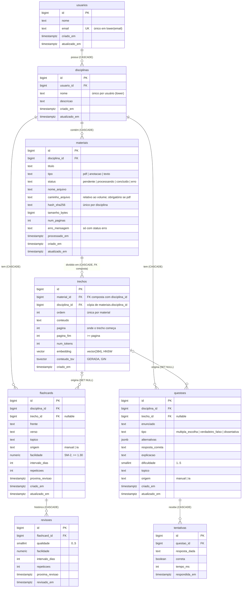

# Modelagem do banco — estuda-ai

Este documento explica **por que** o schema é como é. O código-fonte da verdade são as
migrations em `backend/alembic/versions/` (o DDL de fato) e `backend/app/models.py`
(o espelho em SQLAlchemy). Se os dois divergirem, `alembic check` acusa.

A busca (embeddings, HNSW, full-text, busca híbrida) tem documento próprio:
[`busca-semantica.md`](busca-semantica.md).

Histórico de migrations:

| Migration | Fase | O que fez |
|---|---|---|
| `schema_inicial` | 1 | 8 tabelas, constraints, índices, trigger de `atualizado_em` |
| `embedding_384_dimensoes` | 2 | `vector(1024)` → `vector(384)` (modelo e5-small) |
| `materiais_status_e_arquivo` | 2 | status `processado` → `concluido`; caminho, erro, páginas |
| `trechos_disciplina_id_e_pagina_fim` | 2 | `disciplina_id` desnormalizado + FK composta; `pagina_fim` |
| `busca_textual_em_trechos` | 2 | `unaccent`, config `portugues_unaccent`, `conteudo_tsv` + GIN |

> Dica de estudo: abra o `psql` e confira cada afirmação daqui.
> `docker compose exec db psql -U estuda_ai -d estuda_ai` e depois `\d+ flashcards`.

---

## 1. Diagrama ER



Como ler a notação (crow's foot):
`||--o{` = "exatamente um" de um lado e "zero ou muitos" do outro.
`|o--o{` = "zero ou um" (FK que aceita NULL) de um lado e "zero ou muitos" do outro.

---

## 2. Convenções que valem para todas as tabelas

### Chave primária: `bigint GENERATED ALWAYS AS IDENTITY`

- **Por que não `serial`?** `serial` é um atalho antigo, específico do Postgres
  (cria uma sequência "solta"). `IDENTITY` é padrão SQL e amarra a sequência à coluna.
- **Por que `ALWAYS`?** Impede `INSERT ... (id) VALUES (42)`. Se alguém inserisse ids
  manuais, a sequência não saberia e o próximo `INSERT` automático colidiria.
- **Por que não UUID?** UUID ocupa 16 bytes (bigint, 8) e, se for aleatório (v4), cada
  inserção cai num ponto aleatório do índice B-tree da PK, espalhando escritas pelo disco.
  Ids crescentes sempre entram no fim do índice. UUID vale a pena quando ids são gerados
  fora do banco ou não podem ser adivinháveis na URL — não é o nosso caso agora.
- **Buracos na numeração são normais.** Uma transação que faz `ROLLBACK` não devolve o
  número que pegou da sequência. Nunca use o id como "contador".

### Datas: `timestamptz`, nunca `timestamp`

`timestamptz` guarda um **instante** (internamente em UTC) e converte para o fuso da
sessão ao exibir. `timestamp` (sem tz) guarda "uma data no calendário" sem dizer de onde:
`2026-10-07 10:00` em Rio Grande ou em Lisboa? Para "quando aconteceu", sempre `timestamptz`.

### `criado_em` / `atualizado_em`

- `criado_em` tem `DEFAULT now()`.
- `atualizado_em` é mantido por um **trigger** `BEFORE UPDATE` (função
  `definir_atualizado_em()`). Ele fica no banco — e não só no ORM — para funcionar
  também quando alguém faz `UPDATE` direto no `psql`.
- Tabelas de **histórico** (`revisoes`, `tentativas`) e `trechos` são imutáveis
  (só recebem `INSERT`), então não têm `atualizado_em`.
- Detalhe: `now()` retorna o horário de **início da transação**. Tudo que acontece na
  mesma transação recebe o mesmo instante (`clock_timestamp()` daria o horário real).

### "Enums" com `text + CHECK`

Ex.: `CHECK (tipo IN ('pdf', 'anotacao', 'texto'))`. A alternativa seria
`CREATE TYPE tipo_material AS ENUM (...)`. Com ENUM, **adicionar** valor é fácil, mas
**remover ou renomear** exige recriar o tipo e reescrever as colunas. Trocar um CHECK é
`DROP CONSTRAINT` + `ADD CONSTRAINT`. O custo: `text` ocupa alguns bytes a mais que um
ENUM (4 bytes). Para nosso volume, irrelevante.

### Nomes de constraints previsíveis

Toda constraint tem nome explícito: `pk_<tabela>`, `fk_<tabela>_<coluna>_<referida>`,
`uq_...`, `ck_<tabela>_<regra>`. Sem isso, o Postgres inventa nomes como
`disciplinas_usuario_id_fkey`, e uma migration futura que precise apagar a constraint
teria que adivinhá-lo. Os erros também ficam legíveis:
`violates check constraint "ck_questoes_alternativas_conforme_tipo"`.

### `NULL` em `CHECK`: lógica de três valores

`CHECK (pagina >= 1)` com `pagina = NULL` resulta em `NULL` — e **um CHECK só reprova
quando o resultado é `false`**. Ou seja: a coluna pode ser nula, mas se tiver valor, ele
precisa ser válido. Isso é a lógica de três valores do SQL (true / false / unknown) e
explica por que `WHERE x = NULL` nunca encontra nada (use `IS NULL`).

---

## 3. Tabela por tabela

### `usuarios`

Quem usa o sistema. Ainda **não** tem `senha_hash`: autenticação entra numa fase
futura, com uma migration que adiciona a coluna — ótimo exercício de evolução de schema
(como adicionar uma coluna `NOT NULL` numa tabela que já tem linhas?).

- `UNIQUE` em `lower(email)`: é um **índice de expressão**. Sem o `lower()`,
  `Ana@X.com` e `ana@x.com` seriam contas diferentes. Um UNIQUE sobre expressão só pode
  ser criado como índice (`CREATE UNIQUE INDEX`), não como constraint de tabela.
  Para o índice ser usado na busca, a consulta precisa usar a mesma expressão:
  `WHERE lower(email) = lower(:email)`.
- `CHECK (position('@' in email) > 1)`: validação mínima. Validação completa fica na API
  (Pydantic `EmailStr`); o banco garante só o que nunca pode ser violado.

### `disciplinas`

Cada disciplina pertence a **um** usuário (1:N).

- `usuario_id ... ON DELETE CASCADE`: apagar o usuário apaga as disciplinas dele (e,
  em cadeia, tudo abaixo). Faz sentido porque disciplina não existe sem dono.
- `UNIQUE (usuario_id, lower(nome))`: o mesmo usuário não tem duas "Cálculo I", mas dois
  usuários diferentes podem ter. A unicidade é **por usuário**, por isso composta.
- Esse índice também serve para `WHERE usuario_id = ?`. Um índice B-tree em `(a, b)`
  atende buscas por `a` sozinho (regra do **prefixo à esquerda**), mas não por `b` sozinho.
  Por isso não criamos um índice separado em `usuario_id`.

### `materiais`

Um arquivo ou anotação enviado para uma disciplina.

- `status` modela uma pequena **máquina de estados** do processamento:
  `pendente → processando → concluido | erro` (e `erro → pendente` ao reprocessar).
  Na fase 2 o valor `processado` virou `concluido`: com `text + CHECK` isso foi um
  DROP CONSTRAINT + UPDATE + ADD CONSTRAINT (ver `busca-semantica.md`, seção 9).
- CHECKs condicionais, a forma SQL de "se A então B" (`NOT A OR B`):
  `erro_mensagem IS NULL OR status = 'erro'` e `tipo <> 'pdf' OR caminho_arquivo IS NOT NULL`.
- `caminho_arquivo` é **relativo** à pasta de uploads: mudar o ponto de montagem do
  volume não exige migrar dados.
- `hash_sha256` + `UNIQUE (disciplina_id, hash_sha256)`: o mesmo PDF não é processado
  (nem pago em embeddings) duas vezes na mesma disciplina. O `CHECK` com regex
  (`~ '^[0-9a-f]{64}$'`) garante que é mesmo um SHA-256 em hexadecimal.
- O arquivo em si **não** fica no banco (fica num volume Docker). Guardar binários grandes
  no Postgres incha backups e o cache de páginas; o banco guarda os metadados.
- `UNIQUE (id, disciplina_id)`: redundante com a PK (o `id` sozinho já é único), mas é o
  alvo exigido pela FK composta de `trechos` (seção 4b).

### `trechos`

Pedaços (*chunks*) do texto de um material, cada um com seu embedding.

- `UNIQUE (material_id, ordem)`: posição do trecho dentro do material. Permite
  reconstruir o texto e buscar "o trecho anterior e o próximo" para dar contexto ao RAG.
- `embedding vector(384)`: tipo da extensão **pgvector**. A dimensão é fixa: todos os
  vetores da coluna precisam ter 384 números, a saída do modelo local
  `intfloat/multilingual-e5-small`. A fase 1 tinha criado `vector(1024)` (pensando em
  Voyage AI ou bge-m3); a fase 2 trocou com uma migration nova, `USING NULL`, porque
  embedding de um modelo não se converte para outro.
- `embedding` é **nullable** no schema, mas na prática todo trecho nasce com embedding:
  trechos e vetores são gravados juntos, na mesma transação. Linhas com `NULL` não
  entrariam no índice HNSW.
- `disciplina_id` é uma **cópia** de `materiais.disciplina_id` (seção 4b) e `pagina_fim`
  registra onde termina um trecho que atravessa páginas.
- `conteudo_tsv` é uma **coluna gerada** (`GENERATED ALWAYS AS (to_tsvector(...)) STORED`):
  o banco a calcula a partir de `conteudo` e ninguém consegue gravá-la à mão.

### `flashcards`

Pergunta (`frente`) e resposta (`verso`) para memorização.

- `trecho_id ... ON DELETE SET NULL`: se o material de origem for apagado, o flashcard
  **continua existindo** (você já o estudou; o histórico de revisões vale), só perde o
  vínculo com a fonte. Compare com `CASCADE` em `disciplina_id`: apagar a disciplina
  apaga os cards.
- **Estado atual do SM-2** (`facilidade`, `intervalo_dias`, `repeticoes`,
  `proxima_revisao`): veja a seção 4 — é uma desnormalização intencional.
- `facilidade numeric(4,2)` em vez de `float`: `numeric` é **exato** (base 10). Com
  `float`, `2.5 - 0.14 - 0.14 ...` acumula erros de arredondamento binário. O SM-2 define
  o fator com 2 casas e mínimo 1.3 — o `CHECK (facilidade >= 1.30)` impõe isso.
- Card novo nasce com `proxima_revisao = now()`: já aparece para estudo.

### `revisoes`

**Histórico imutável**: uma linha por revisão feita. Guarda a nota dada (`qualidade`,
0–5 no SM-2) e o estado resultante.

- `CHECK (proxima_revisao >= revisado_em)`: uma revisão nunca agenda a próxima para o
  passado. É uma constraint que compara **duas colunas da mesma linha** — CHECK pode
  fazer isso; o que CHECK não pode é olhar outras linhas ou outras tabelas.
- Índice `(flashcard_id, revisado_em)`: "histórico deste card em ordem" sai direto do
  índice, sem ordenar depois.

### `questoes`

Questões de prova (múltipla escolha, V/F, dissertativa).

- `alternativas jsonb`: lista como `["A) ...", "B) ..."]`. A alternativa "pura" seria uma
  tabela `alternativas(questao_id, letra, texto)`. Escolhemos `jsonb` porque alternativas
  não têm vida própria: são sempre lidas e escritas junto com a questão, e nunca
  consultadas sozinhas. **Regra prática:** se você vai filtrar, juntar ou referenciar o
  dado por FK, ele merece uma tabela; se é um "anexo" lido inteiro, `jsonb` serve.
- O `CHECK ck_questoes_alternativas_conforme_tipo` amarra coluna e tipo:
  múltipla escolha exige um array com 2+ itens; os outros tipos exigem `NULL`. Usa `CASE`
  aninhado porque o SQL **não garante a ordem de avaliação do `AND`**: em
  `jsonb_typeof(x) = 'array' AND jsonb_array_length(x) >= 2` o banco poderia avaliar o
  segundo termo primeiro e dar erro num objeto. `CASE` garante a ordem.

### `tentativas`

**Histórico imutável** das respostas a questões.

- Não tem `usuario_id`. Ver seção 5 (normalização).
- Índice `(questao_id, respondida_em)`: desempenho por questão ao longo do tempo
  (base do dashboard da fase 5).

---

## 4. A desnormalização consciente: estado do SM-2

O estado atual de um flashcard **pode ser derivado** de `revisoes` (é a última linha).
Guardá-lo também em `flashcards` é redundância — portanto, desnormalização. Por que fazer?

A consulta mais frequente do app é *"quais cards eu devo revisar agora?"*:

```sql
SELECT f.*
FROM flashcards f
WHERE f.disciplina_id = :disciplina
  AND f.proxima_revisao <= now()
ORDER BY f.proxima_revisao
LIMIT 20;
```

Com o estado em `flashcards`, ela usa o índice `(disciplina_id, proxima_revisao)`:
o Postgres pula direto para a disciplina e lê os cards já em ordem de data, parando
no 20º. Sem o cache, seria preciso achar **a última revisão de cada card** antes de
filtrar — algo como `DISTINCT ON (flashcard_id) ... ORDER BY flashcard_id, revisado_em DESC`
ou um `LATERAL` — muito mais trabalho a cada abertura da tela.

**O preço:** as duas cópias podem divergir. A regra é que **toda revisão grava as duas
coisas na mesma transação** (`INSERT INTO revisoes` + `UPDATE flashcards`). Se uma falhar,
o `ROLLBACK` desfaz a outra — é exatamente para isso que transações existem (o "A" de
ACID, atomicidade). Isso será implementado na fase 4.

---

## 4b. A segunda desnormalização: `trechos.disciplina_id` e a FK composta

`trechos.disciplina_id` é determinado por `material_id` (o material já sabe a sua
disciplina): dependência transitiva, que fere a 3FN. Copiamos mesmo assim porque **toda
busca filtra por disciplina**, e com a coluna na própria tabela:

- o filtro fica junto do índice vetorial (sem JOIN antes de poder filtrar);
- um B-tree em `disciplina_id` deixa o planejador escolher **busca exata** para
  disciplinas pequenas. No experimento: 0,20 ms e recall 1,0, contra 3,3 ms e recall 0,88
  do HNSW com filtro (`busca-semantica.md`, seção 5).

O risco de qualquer cópia é **divergir** do original. Aqui o banco impede isso:

```sql
-- em vez de FOREIGN KEY (material_id) REFERENCES materiais (id):
FOREIGN KEY (material_id, disciplina_id)
    REFERENCES materiais (id, disciplina_id)
    ON DELETE CASCADE ON UPDATE CASCADE
```

- É impossível gravar um trecho dizendo "sou da disciplina 7" se o material dele é da 9:
  o **par** precisa existir em `materiais` (`test_fk_composta_impede_trecho_com_...`).
- Uma FK precisa apontar para colunas com `UNIQUE` ou `PRIMARY KEY`. `(id, disciplina_id)`
  já é único na prática, porque `id` é PK, mas o Postgres exige a constraint declarada:
  daí `uq_materiais_id_disciplina_id`. Ela custa um índice a mais em `materiais`, uma
  tabela pequena.
- `ON UPDATE CASCADE`: se um material mudar de disciplina, o Postgres atualiza a cópia
  em todos os trechos dele (`test_mover_material_de_disciplina_atualiza_os_trechos`).

Compare com a desnormalização do SM-2 (seção 4), em que a coerência depende do código
gravar as duas coisas na mesma transação. Aqui é o próprio banco que garante.

Como a coluna foi adicionada a uma tabela que poderia já ter linhas: `ADD COLUMN` nullable
→ `UPDATE ... FROM materiais` → `SET NOT NULL`. Não dá para exigir `NOT NULL` de uma
coluna nova antes de preenchê-la.

---

## 5. Normalização

Resumo das formas normais aplicadas aqui:

- **1FN** — valores atômicos, sem grupos repetidos. Ex.: não há colunas
  `alternativa_a, alternativa_b, ...`. (O `jsonb` de `alternativas` é uma exceção
  consciente; ver `questoes`.)
- **2FN** — nenhum atributo depende de *parte* de uma chave composta. Como todas as PKs
  são uma única coluna (`id`), a 2FN é automática.
- **3FN** — nenhum atributo depende de outro atributo não-chave
  (sem **dependência transitiva**).

Exemplo de 3FN no schema: `tentativas` **não** tem `usuario_id`. O dono de uma tentativa
é determinado por `tentativa → questão → disciplina → usuário`. Guardar `usuario_id` em
`tentativas` criaria uma dependência transitiva — e a possibilidade de uma tentativa
dizer "sou do usuário 7" enquanto a questão dela pertence ao usuário 9.

Exceções conscientes (e onde estão documentadas):

| Onde | O quê | Por quê |
|---|---|---|
| `flashcards` | estado do SM-2 copiado de `revisoes` | desempenho da consulta do dia (seção 4) |
| `trechos.disciplina_id` | cópia de `materiais.disciplina_id` | filtro da busca junto do índice; protegida por FK composta (seção 4b) |
| `questoes.alternativas` | lista em `jsonb` | dado sempre lido junto, nunca filtrado |
| `topico` (texto livre) | sem tabela própria | ainda não sabemos os tópicos; ver abaixo |

**Problema conhecido, de propósito:** `topico` é texto livre em `flashcards` e `questoes`.
Logo vão aparecer `"Árvores"`, `"arvores"` e `"Árvore B"` para a mesma coisa, e o
`GROUP BY topico` do dashboard vai sair errado. Na fase 5 isso vira uma tabela
`topicos (id, disciplina_id, nome)` com FK — e você vai sentir na prática por que
normalizar.

---

## 6. Índices: quais existem e por quê

Regra geral: **todo índice acelera leituras e encarece escritas** (cada `INSERT`/`UPDATE`
atualiza todos os índices da tabela) e ocupa espaço. Só criamos índice com uma consulta
concreta em mente.

> **Armadilha clássica:** o Postgres cria índice automaticamente para `PRIMARY KEY` e
> `UNIQUE`, mas **não** para `FOREIGN KEY`. Sem índice na coluna da FK, um
> `DELETE` no pai (que precisa achar os filhos para o `CASCADE`/`SET NULL`) faz
> *sequential scan* na tabela filha inteira.

| Índice | Tipo | Consulta que atende |
|---|---|---|
| `pk_*` (todas) | B-tree, único | busca por id; automático |
| `uq_usuarios_email_lower` | B-tree, único, expressão | login / cadastro por e-mail |
| `uq_disciplinas_usuario_nome` | B-tree, único, composto | "disciplinas do usuário X" + FK `usuario_id` |
| `uq_materiais_disciplina_id_hash_sha256` | B-tree, único, composto | dedupe de upload + FK `disciplina_id` + listar materiais |
| `uq_materiais_id_disciplina_id` | B-tree, único, composto | alvo da FK composta de `trechos` |
| `uq_trechos_material_id_ordem` | B-tree, único, composto | trechos de um material em ordem + FK composta (prefixo `material_id`) |
| `ix_trechos_disciplina_id` | B-tree | busca exata em disciplina pequena; filtro da busca textual |
| `ix_trechos_embedding_hnsw` | **HNSW** (pgvector) | busca semântica por similaridade |
| `ix_trechos_conteudo_tsv` | **GIN** | busca textual (`@@`) |
| `ix_flashcards_disciplina_proxima_revisao` | B-tree, composto | "o que revisar hoje" + FK `disciplina_id` |
| `ix_flashcards_trecho_id` | B-tree, **parcial** | FK `trecho_id` (o `SET NULL` ao apagar trecho) |
| `ix_revisoes_flashcard_revisado_em` | B-tree, composto | histórico de um card + FK |
| `ix_questoes_disciplina_id` | B-tree | questões de uma disciplina + FK |
| `ix_questoes_trecho_id` | B-tree, **parcial** | FK `trecho_id` |
| `ix_tentativas_questao_respondida_em` | B-tree, composto | desempenho por questão + FK |

### B-tree

Árvore balanceada e ordenada — o índice padrão. Atende `=`, `<`, `>`, `BETWEEN`,
`ORDER BY` e prefixos de `LIKE 'abc%'`. Num índice composto `(a, b)` as entradas estão
ordenadas por `a` e, empatando, por `b`. Por isso `(disciplina_id, proxima_revisao)`
responde "disciplina = X **e** data ≤ agora, em ordem de data" lendo um trecho contíguo
do índice. A ordem das colunas importa: `(proxima_revisao, disciplina_id)` seria bem pior
para essa consulta.

### Índice parcial

`CREATE INDEX ... ON flashcards (trecho_id) WHERE trecho_id IS NOT NULL` só indexa as
linhas que satisfazem o `WHERE`. Cards criados manualmente (sem trecho) não ocupam
espaço no índice — e nunca seriam procurados por `trecho_id = ?` mesmo.

### HNSW (busca vetorial)

Achar "os 5 trechos mais parecidos com a pergunta" exatamente exige comparar com
**todos** os vetores (busca exata, O(n)). O HNSW (*Hierarchical Navigable Small World*)
monta um grafo em camadas onde cada vetor está ligado aos vizinhos próximos; a busca
"navega" pelo grafo e devolve vizinhos **aproximados** muito mais rápido. É um índice
ANN (*approximate nearest neighbor*): troca um pouco de precisão (*recall*) por velocidade.

- `vector_cosine_ops`: o índice é construído para a **distância de cosseno**, que casa com
  o operador `<=>`. A consulta precisa usar o mesmo operador para o índice ser usado:
  `ORDER BY embedding <=> :pergunta LIMIT 5`. (`<->` = distância euclidiana,
  `<#>` = produto interno negativo — cada um tem seu `opclass`.)
- `m = 16`: quantas conexões cada nó tem. Mais = mais preciso, índice maior.
- `ef_construction = 64`: quantos candidatos avaliar ao inserir. Mais = índice melhor,
  construção mais lenta.
- Na busca, `SET hnsw.ef_search = 40` (padrão) controla o equilíbrio velocidade × recall.
- **Por que não IVFFlat?** O outro índice do pgvector precisa ser criado *depois* de já
  existirem dados (ele agrupa os vetores em listas com k-means). O HNSW pode ser criado
  com a tabela vazia e se mantém bom conforme os dados chegam — ideal para nós.
- **Filtro + busca aproximada** é delicado: o HNSW acha os `ef_search` mais próximos no
  geral e o filtro é aplicado depois. Medido na fase 2: numa disciplina com 1% dos
  trechos, sem iterative scan, voltaram 1,5 de 10 linhas. Detalhes e números em
  `busca-semantica.md`, seções 4 e 5.

### GIN (busca textual)

Índice **invertido**: para cada lexema, a lista de linhas que o contêm (como o índice
remissivo de um livro). Atende `tsvector @@ tsquery`. Detalhes em `busca-semantica.md`,
seção 6.

---

## 7. ON DELETE: o que acontece ao apagar

| Ao apagar... | Efeito | Por quê |
|---|---|---|
| usuário | `CASCADE` → disciplinas → materiais, trechos, flashcards, revisões, questões, tentativas | tudo pertence ao usuário |
| disciplina | `CASCADE` → materiais, flashcards, questões (e descendentes) | conteúdo da disciplina |
| material | `CASCADE` → trechos (pela FK composta) | trechos são pedaços do material |
| trecho | `SET NULL` em `flashcards.trecho_id` e `questoes.trecho_id` | o card/questão sobrevive à fonte |
| flashcard | `CASCADE` → revisões | histórico sem card não tem sentido |
| questão | `CASCADE` → tentativas | idem |

Atualizar `materiais.disciplina_id` propaga para `trechos.disciplina_id`
(`ON UPDATE CASCADE` da FK composta).

Opções que não usamos: `RESTRICT`/`NO ACTION` (impede apagar o pai enquanto houver
filhos — útil para dados que nunca devem sumir em cascata, como pedidos de uma loja)
e `SET DEFAULT`.

No ORM, os relacionamentos usam `passive_deletes=True`: o SQLAlchemy **não** carrega os
filhos para apagá-los um a um; ele emite um único `DELETE` no pai e deixa o Postgres
cuidar da cascata.

---

## 8. Para conferir no psql

```sql
\d+ flashcards                       -- colunas, constraints, índices e triggers
SELECT * FROM pg_extension;          -- versão do pgvector
SELECT indexname, indexdef FROM pg_indexes WHERE tablename = 'trechos';

-- Ver o planejador escolhendo (ou não) um índice:
EXPLAIN SELECT * FROM disciplinas WHERE usuario_id = 1;
```

Com tabelas quase vazias, o `EXPLAIN` vai mostrar *Seq Scan* mesmo com índice: ler 3
linhas direto é mais barato que consultar o índice. O planejador decide por **custo
estimado**, a partir de estatísticas (`ANALYZE`). Na fase 6 vamos popular o banco e ver
os índices entrando em ação.
