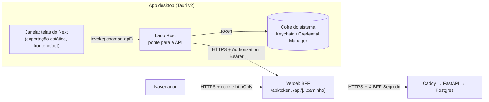

# App desktop e modo foco (fase 7)

O app desktop (Windows e macOS) reaproveita as telas do frontend e acrescenta o que uma
página web não consegue fazer: sessões de estudo que continuam sem internet, controle do
Spotify, janela de foco por cima de tudo e bloqueio de programas e sites.

A fase tem quatro sessões. Este documento cresce com elas:

| Sessão | Conteúdo | Estado |
|---|---|---|
| 1 | App Tauri, login no desktop, instaladores pelo CI | **concluída** |
| 2 | Sessões de estudo, sincronização offline com idempotência, analytics | a fazer |
| 3 | Spotify: OAuth com PKCE, token cifrado, player | a fazer |
| 4 | Bloqueio de programas e sites (arquivo hosts), saída de emergência | a fazer |

---

## 1. Arquitetura



Um app Tauri tem duas metades:

- **a janela** é um navegador embutido do sistema (WebKit no macOS, WebView2/Edge no
  Windows) que mostra HTML/CSS/JS. Aqui, as mesmas telas da web;
- **o processo Rust** é um programa nativo comum, com acesso ao sistema (arquivos,
  processos, cofre de senhas, rede sem CORS).

As duas metades conversam por **IPC**: a página chama `invoke("nome", argumentos)` e
uma função Rust marcada com `#[tauri::command]` responde. Comparado ao Electron, o
instalador fica minúsculo (o `.dmg` universal tem ~8 MB, contra ~100 MB de um Electron)
porque o navegador já vem no sistema.

Arquivos:

```
desktop/
├── Cargo.toml              # workspace: nucleo + src-tauri
├── package.json            # só a CLI do Tauri
├── nucleo/src/api.rs       # regras puras: URL da API, allowlist (testes rápidos, sem Tauri)
└── src-tauri/
    ├── tauri.conf.json     # janela, CSP, bundles (.dmg/.msi/.exe)
    ├── build.rs            # manifesto dos comandos (viram permissões)
    ├── capabilities/       # o que a janela pode chamar
    └── src/
        ├── ponte.rs        # comandos chamar_api, entrar, sair
        └── cofre.rs        # token no cofre do sistema
```

## 2. Por que exportação estática do Next

Havia três formas de reaproveitar as telas:

| Opção | Como | Problema |
|---|---|---|
| Janela aponta para o site | `url: "https://estuda-ai-jade.vercel.app"` | Sem internet, o app não abre: o modo offline da sessão 2 morreria. E o site remoto ganharia acesso aos comandos que, na sessão 4, fecham programas e editam o arquivo hosts. Uma invasão da Vercel viraria uma invasão do seu computador. |
| Servidor Node embutido | o app sobe o `server.js` do Next num processo filho | Mais ~80 MB no instalador, um processo a mais para vigiar e uma porta local aberta. |
| **Exportação estática** ✅ | `output: "export"`: HTML/JS/CSS prontos em `frontend/out`, servidos de dentro do app | É preciso adaptar o que exige servidor (abaixo). |

A exportação gera arquivos fixos no build. O que exige um servidor rodando não existe
nela, e foi adaptado assim:

- **Rota dinâmica `/disciplinas/[id]`:** o build precisaria conhecer todos os ids, que só
  existem no banco. Virou `/disciplina?id=5`: uma página só, que lê o id no cliente. Os
  links antigos redirecionam na web (o redirect é coisa de servidor, então existe só lá).
- **BFF (`app/api/**`) e `proxy.ts`:** são servidor por definição. Viraram arquivos
  `.web.ts`. A web inclui essa extensão em `pageExtensions` e o desktop não, então o
  Next simplesmente não os enxerga no build estático.
- **Cache Components/PPR:** a pré-renderização parcial completa a página no servidor, na
  hora do pedido. A exportação recusa ("PPR cannot be enabled in export mode"), então fica
  desligada só no desktop.

Os dois alvos saem do mesmo código. Quem decide é a variável `ALVO` no
`frontend/next.config.ts`. O script `frontend/scripts/alvo-desktop.mjs` existe porque
`ALVO=desktop next build` é sintaxe do shell do Mac e não funciona no `cmd.exe` do
Windows.

## 3. Login no desktop: onde fica o token

Na web, o JWT fica num cookie `httpOnly` que o JavaScript não consegue ler
([`frontend.md`](frontend.md), seção 1). No desktop não há servidor Next para ler um
cookie. A solução equivalente é **o token nunca entrar no JavaScript**:

1. A tela de login chama `invoke("entrar", { email, senha })`.
2. O Rust faz `POST https://<BFF>/api/token` e recebe `{ access_token, expira_em }`.
3. O Rust grava o token no **cofre do sistema** (crate `keyring`): Keychain no macOS,
   Gerenciador de Credenciais no Windows. Para a página, só volta "deu certo" (204).
4. Toda chamada da página vira `invoke("chamar_api", corpo, { x-metodo, x-caminho })`. O
   Rust lê o token do cofre e chama o BFF com `Authorization: Bearer`.
5. Se a API responder 401 (expirou ou houve "sair de todos"), o Rust apaga o token, e a
   página volta para o login, como na web.

**Por que o cofre e não um arquivo?** Um arquivo de texto é lido por qualquer programa
rodando como você e vai parar em backups e pastas sincronizadas. O cofre é cifrado pelo
sistema e atrelado ao seu login. No macOS, ele ainda pede permissão quando outro
programa tenta ler o item. O token fica guardado por servidor (a "conta" no cofre é a
origem da URL), então o de desenvolvimento (`localhost`) nunca vai para a produção.

**O cliente tipado não mudou.** O `openapi-fetch` aceita um `fetch` próprio. No desktop,
ele recebe `fetchPelaPonte` (`frontend/src/lib/desktop.ts`), que embrulha o pedido num
`invoke` e devolve um `Response` normal. As telas e os hooks do TanStack Query são os
mesmos.

### Por que o desktop passa pelo BFF (e não direto pela API)

A API só aceita quem traz o `X-BFF-Segredo` (o Caddy responde 404 aos outros). O
desktop tinha duas saídas:

- **Direto na API:** o Caddy teria de liberar as rotas para quem não tem o segredo. A API
  ficaria exposta à internet, e o rate limit do login precisaria aprender a confiar no IP
  repassado pelo Caddy.
- **Pelo BFF** ✅: o portão continua único. O instalador não carrega segredo nenhum (tudo
  o que vai dentro de um binário distribuído deve ser tratado como público). O IP real
  chega à API pelo caminho que já existia (`X-Cliente-IP`).

O BFF ganhou duas regras (funções puras em `frontend/src/lib/bff.ts`, com testes):

- **Bearer dispensa a checagem de CSRF.** CSRF existe porque o navegador anexa o
  *cookie* sozinho, até em requisições disparadas por outro site. Um cabeçalho
  `Authorization` ninguém anexa por você: só quem já tem o token consegue mandá-lo. E um
  site alheio que tentasse (um `fetch` com `Authorization`) cairia no *preflight* de CORS,
  que o BFF não autoriza. Com cookie, a checagem continua obrigatória.
- **`/api/token` só para cliente nativo.** Essa rota devolve o token no corpo, e por isso
  recusa quem manda `Sec-Fetch-Site`. Todo navegador moderno manda esse cabeçalho em
  todo `fetch`; o Rust não manda. Assim, um script injetado numa página web (XSS) não
  consegue obter por aqui o token que o cookie `httpOnly` esconde.

## 4. A fronteira de confiança: a página não é confiável

Trate a página como se pudesse ser comprometida (um PDF malicioso explorando um bug de
renderização, por exemplo). Mesmo assim, ela não pode:

- **mandar o token para outro servidor.** `nucleo::api::url_da_chamada` acrescenta cada
  segmento com `path_segments_mut()`, que trata cada pedaço como UM segmento: não existe
  `//evil.com` que troque o host. No fim, a origem (esquema + host + porta) é conferida
  de novo. O cliente HTTP não segue redirecionamentos, que levariam o Bearer junto;
- **chamar rotas fora da lista.** A allowlist é a mesma do BFF. `..`, `.`, `//` e `\` são
  recusados em qualquer posição, inclusive codificados (`%2e%2e`). É a mesma lição do
  `bff.test.ts` da fase 6;
- **chamar comandos que não lhe foram dados.** O `build.rs` declara os comandos num
  *app manifest*. Cada um vira uma permissão (`allow-chamar-api`...), que só vale se
  constar em `capabilities/principal.json`. É o menor privilégio do papel
  `estuda_ai_app` no banco, aplicado ao IPC. Na sessão 4, os comandos que fecham programas
  e editam o hosts só valem para a janela de foco;
- **carregar script de fora.** A CSP (`tauri.conf.json`) só permite scripts do próprio
  app (`script-src 'self'`) e só conexões com o IPC (`connect-src ipc:`). O Next coloca
  scripts *inline* no HTML; o Tauri calcula o hash de cada um no build e o acrescenta à
  CSP, então não foi preciso liberar `'unsafe-inline'` para scripts.

HTTPS é obrigatório fora do `localhost` (`base_da_api`), porque o token vai em toda
chamada.

## 5. Instaladores e CI

| Sistema | Arquivo | Observação |
|---|---|---|
| macOS | `estuda-ai_<versão>_universal.dmg` | Um binário com as duas arquiteturas (Apple Silicon e Intel), `--target universal-apple-darwin`. Assinatura *ad-hoc* (`signingIdentity: "-"`): sem ela, o macOS em Apple Silicon nem executa o binário. |
| Windows | `.msi` (WiX) e `-setup.exe` (NSIS) | Use o `.exe`: ele instala só para o seu usuário (`installMode: currentUser`), sem pedir administrador. |

O workflow `.github/workflows/desktop.yml` monta os dois numa matriz (macOS + Windows):

- **tag `desktop-v0.1.0`:** cria uma **Release em rascunho** com os instaladores. Você
  confere e publica;
- **botão "Run workflow"** (aba Actions → Desktop): só gera os instaladores como
  artefatos da execução.

Os builds só geram artefatos. Quem cria a Release é um job final em Linux (`release`),
que junta os instaladores dos dois sistemas e calcula o SHA-256 de cada um. Na primeira
versão (0.1.0), cada sistema criava a Release pelo `tauri-action` e os dois receberam
`403 Resource not accessible by integration`, mesmo com `contents: write` no token. Os
instaladores tinham sido gerados, então a Release foi montada à mão com eles. Com um job
só criando a Release, não há mais corrida entre os dois sistemas, e uma falha de
permissão custa 1 minuto de Linux, não um build inteiro. Se acontecer de novo, o contorno
é o mesmo daquela vez, com a sua conta:

```bash
gh run download <id da execução> -R bergols/estuda-ai -D instaladores
```

```bash
gh release create desktop-v<versão> instaladores/*/*.dmg instaladores/*/*-setup.exe instaladores/*/*.msi -R bergols/estuda-ai --draft --verify-tag
```

**Por que não a cada push?** O repositório é privado. No plano grátis, o GitHub dá
2.000 minutos por mês, mas um minuto de macOS conta como 10 e um de Windows como 2. Um
build universal do Mac leva cerca de 15 minutos no CI (~150 da cota). Por isso, a cada
push, o `ci.yml` só faz o que é barato em Linux: a exportação estática (fácil de quebrar
sem perceber) e `fmt`/`clippy`/testes do crate `nucleo`. O `nucleo` não depende do Tauri,
então compila sem o WebKit do Linux. Os testes do app inteiro rodam no `desktop.yml`,
no próprio Windows e macOS.

## 6. Instalar sem assinatura de código

Assinar apps custa dinheiro: Apple Developer, US$ 99 por ano; certificado de assinatura
para Windows, a partir de ~US$ 100 por ano. Sem assinatura, os dois sistemas avisam na
primeira vez. O aviso existe porque o sistema não consegue confirmar quem fez o app.
Como quem fez foi você, a partir do seu próprio repositório, pode abrir.

### macOS (Gatekeeper)

Arquivos baixados pelo navegador ganham o atributo de "quarentena". O Gatekeeper só
deixa abrir sem perguntar apps assinados *e* notarizados pela Apple.

1. Abra o `.dmg` e arraste o **estuda-ai** para **Aplicativos**.
2. Abra o app. Aparece "A Apple não pôde verificar se 'estuda-ai' está livre de
   malware". Clique em **OK** (não em "Mover para o Lixo").
3. Abra **Ajustes do Sistema → Privacidade e Segurança**, role até "Segurança" e clique
   em **Abrir Mesmo Assim** ao lado do aviso do estuda-ai. Confirme com a sua senha.
   Desde o macOS 15, o antigo "clique com o botão direito → Abrir" não basta mais.

Alternativa pelo Terminal, que remove a quarentena:

```bash
xattr -dr com.apple.quarantine /Applications/estuda-ai.app
```

**Keychain:** depois de cada atualização do app, o macOS pode perguntar se o
**estuda-ai** pode acessar o item "estuda-ai" das chaves. Responda **Sempre Permitir**.
Isso acontece porque, sem certificado, cada build tem uma assinatura diferente, e o
Keychain associa o item à assinatura do app que o criou.

### Windows (SmartScreen)

O Windows marca arquivos baixados com a "Marca da Web", e o SmartScreen desconfia de
executáveis sem assinatura e ainda pouco baixados.

1. Execute o `estuda-ai_<versão>_x64-setup.exe`.
2. Na tela azul "O Windows protegeu o computador", clique em **Mais informações** e
   depois em **Executar assim mesmo**.

Se aparecer "O Controle Inteligente de Aplicativos bloqueou...", o Windows 11 está com o
Smart App Control ligado, e ele bloqueia apps sem assinatura sem opção de "executar
mesmo assim". Nesse caso, a única saída é desligá-lo (Segurança do Windows → Controle de
aplicativos e do navegador). Essa decisão é sua, e ele não volta a ligar sozinho.

## 7. Rodar em desenvolvimento

Pré-requisitos: Rust (`rustup`), Node 22. No macOS, as Xcode Command Line Tools. No
Windows, as "Desktop development with C++" do Visual Studio Build Tools e o WebView2
(já vem no Windows 11).

```bash
# 1. API local + web com o BFF na porta 3000 (o desktop em dev usa este BFF)
docker compose up -d
npm --prefix frontend run dev
```

```bash
# 2. App desktop: sobe o next dev do alvo desktop (porta 3001) e abre a janela
npm --prefix desktop install
ESTUDA_AI_URL=http://localhost:3000 npm --prefix desktop run dev
```

```bash
# Testes: núcleo (rápido) e o fluxo real (BFF local + Keychain de verdade)
cargo test --manifest-path desktop/Cargo.toml
ESTUDA_AI_TESTE_SENHA=<senha da conta demo> cargo test --manifest-path desktop/Cargo.toml -- --ignored
```

```bash
# Instalador local (só do sistema em que você está)
npm --prefix desktop run build -- --target universal-apple-darwin
```

O `ESTUDA_AI_URL` em tempo de execução só vale em build de desenvolvimento. O instalador
usa a URL fixada no build (a variável de repositório `ESTUDA_AI_URL`, ou a da Vercel).
