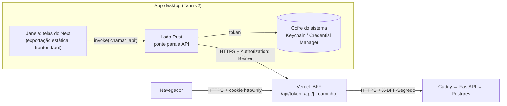

# App desktop e modo foco (fase 7)

O app desktop (Windows e macOS) reaproveita as telas do frontend e acrescenta o que uma
página web não consegue fazer: sessões de estudo que continuam sem internet, controle do
Spotify, janela de foco por cima de tudo e bloqueio de programas e sites.

A fase tem quatro sessões. Este documento cresce com elas:

| Sessão | Conteúdo | Estado |
|---|---|---|
| 1 | App Tauri, login no desktop, instaladores pelo CI | **concluída** |
| 2 | Sessões de estudo, sincronização offline com idempotência, analytics | **concluída** |
| 3 | Spotify: OAuth com PKCE, token cifrado, player | **concluída** |
| 4 | Bloqueio de programas e sites (arquivo hosts), saída de emergência | a fazer |

---

## 1. Arquitetura



Um app Tauri tem duas metades:

- **a janela** é um navegador embutido do sistema (WebKit no macOS, WebView2/Edge no
  Windows) que mostra HTML/CSS/JS. Aqui, as mesmas telas da web;
- **o processo Rust** é um programa nativo comum, com acesso ao sistema (arquivos,
  processos, cofre de senhas, rede sem CORS).

As duas metades conversam por **IPC**: a página chama `invoke("nome", argumentos)` e
uma função Rust marcada com `#[tauri::command]` responde. Comparado ao Electron, o
instalador fica minúsculo (o `.dmg` universal tem ~8 MB, contra ~100 MB de um Electron)
porque o navegador já vem no sistema.

Arquivos:

```
desktop/
├── Cargo.toml              # workspace: nucleo + src-tauri
├── package.json            # só a CLI do Tauri
├── nucleo/src/api.rs       # regras puras: URL da API, allowlist (testes rápidos, sem Tauri)
└── src-tauri/
    ├── tauri.conf.json     # janela, CSP, bundles (.dmg/.msi/.exe)
    ├── build.rs            # manifesto dos comandos (viram permissões)
    ├── capabilities/       # o que a janela pode chamar
    └── src/
        ├── ponte.rs        # comandos chamar_api, entrar, sair
        └── cofre.rs        # token no cofre do sistema
```

## 2. Por que exportação estática do Next

Havia três formas de reaproveitar as telas:

| Opção | Como | Problema |
|---|---|---|
| Janela aponta para o site | `url: "https://estuda-ai-jade.vercel.app"` | Sem internet, o app não abre: o modo offline da sessão 2 morreria. E o site remoto ganharia acesso aos comandos que, na sessão 4, fecham programas e editam o arquivo hosts. Uma invasão da Vercel viraria uma invasão do seu computador. |
| Servidor Node embutido | o app sobe o `server.js` do Next num processo filho | Mais ~80 MB no instalador, um processo a mais para vigiar e uma porta local aberta. |
| **Exportação estática** ✅ | `output: "export"`: HTML/JS/CSS prontos em `frontend/out`, servidos de dentro do app | É preciso adaptar o que exige servidor (abaixo). |

A exportação gera arquivos fixos no build. O que exige um servidor rodando não existe
nela, e foi adaptado assim:

- **Rota dinâmica `/disciplinas/[id]`:** o build precisaria conhecer todos os ids, que só
  existem no banco. Virou `/disciplina?id=5`: uma página só, que lê o id no cliente. Os
  links antigos redirecionam na web (o redirect é coisa de servidor, então existe só lá).
- **BFF (`app/api/**`) e `proxy.ts`:** são servidor por definição. Viraram arquivos
  `.web.ts`. A web inclui essa extensão em `pageExtensions` e o desktop não, então o
  Next simplesmente não os enxerga no build estático.
- **Cache Components/PPR:** a pré-renderização parcial completa a página no servidor, na
  hora do pedido. A exportação recusa ("PPR cannot be enabled in export mode"), então fica
  desligada só no desktop.

Os dois alvos saem do mesmo código. Quem decide é a variável `ALVO` no
`frontend/next.config.ts`. O script `frontend/scripts/alvo-desktop.mjs` existe porque
`ALVO=desktop next build` é sintaxe do shell do Mac e não funciona no `cmd.exe` do
Windows.

## 3. Login no desktop: onde fica o token

Na web, o JWT fica num cookie `httpOnly` que o JavaScript não consegue ler
([`frontend.md`](frontend.md), seção 1). No desktop não há servidor Next para ler um
cookie. A solução equivalente é **o token nunca entrar no JavaScript**:

1. A tela de login chama `invoke("entrar", { email, senha })`.
2. O Rust faz `POST https://<BFF>/api/token` e recebe `{ access_token, expira_em }`.
3. O Rust grava o token no **cofre do sistema** (crate `keyring`): Keychain no macOS,
   Gerenciador de Credenciais no Windows. Para a página, só volta "deu certo" (204).
4. Toda chamada da página vira `invoke("chamar_api", corpo, { x-metodo, x-caminho })`. O
   Rust lê o token do cofre e chama o BFF com `Authorization: Bearer`.
5. Se a API responder 401 (expirou ou houve "sair de todos"), o Rust apaga o token, e a
   página volta para o login, como na web.

**Por que o cofre e não um arquivo?** Um arquivo de texto é lido por qualquer programa
rodando como você e vai parar em backups e pastas sincronizadas. O cofre é cifrado pelo
sistema e atrelado ao seu login. No macOS, ele ainda pede permissão quando outro
programa tenta ler o item. O token fica guardado por servidor (a "conta" no cofre é a
origem da URL), então o de desenvolvimento (`localhost`) nunca vai para a produção.

**O cliente tipado não mudou.** O `openapi-fetch` aceita um `fetch` próprio. No desktop,
ele recebe `fetchPelaPonte` (`frontend/src/lib/desktop.ts`), que embrulha o pedido num
`invoke` e devolve um `Response` normal. As telas e os hooks do TanStack Query são os
mesmos.

### Por que o desktop passa pelo BFF (e não direto pela API)

A API só aceita quem traz o `X-BFF-Segredo` (o Caddy responde 404 aos outros). O
desktop tinha duas saídas:

- **Direto na API:** o Caddy teria de liberar as rotas para quem não tem o segredo. A API
  ficaria exposta à internet, e o rate limit do login precisaria aprender a confiar no IP
  repassado pelo Caddy.
- **Pelo BFF** ✅: o portão continua único. O instalador não carrega segredo nenhum (tudo
  o que vai dentro de um binário distribuído deve ser tratado como público). O IP real
  chega à API pelo caminho que já existia (`X-Cliente-IP`).

O BFF ganhou duas regras (funções puras em `frontend/src/lib/bff.ts`, com testes):

- **Bearer dispensa a checagem de CSRF.** CSRF existe porque o navegador anexa o
  *cookie* sozinho, até em requisições disparadas por outro site. Um cabeçalho
  `Authorization` ninguém anexa por você: só quem já tem o token consegue mandá-lo. E um
  site alheio que tentasse (um `fetch` com `Authorization`) cairia no *preflight* de CORS,
  que o BFF não autoriza. Com cookie, a checagem continua obrigatória.
- **`/api/token` só para cliente nativo.** Essa rota devolve o token no corpo, e por isso
  recusa quem manda `Sec-Fetch-Site`. Todo navegador moderno manda esse cabeçalho em
  todo `fetch`; o Rust não manda. Assim, um script injetado numa página web (XSS) não
  consegue obter por aqui o token que o cookie `httpOnly` esconde.

## 4. A fronteira de confiança: a página não é confiável

Trate a página como se pudesse ser comprometida (um PDF malicioso explorando um bug de
renderização, por exemplo). Mesmo assim, ela não pode:

- **mandar o token para outro servidor.** `nucleo::api::url_da_chamada` acrescenta cada
  segmento com `path_segments_mut()`, que trata cada pedaço como UM segmento: não existe
  `//evil.com` que troque o host. No fim, a origem (esquema + host + porta) é conferida
  de novo. O cliente HTTP não segue redirecionamentos, que levariam o Bearer junto;
- **chamar rotas fora da lista.** A allowlist é a mesma do BFF. `..`, `.`, `//` e `\` são
  recusados em qualquer posição, inclusive codificados (`%2e%2e`). É a mesma lição do
  `bff.test.ts` da fase 6;
- **chamar comandos que não lhe foram dados.** O `build.rs` declara os comandos num
  *app manifest*. Cada um vira uma permissão (`allow-chamar-api`...), que só vale se
  constar em `capabilities/principal.json`. É o menor privilégio do papel
  `estuda_ai_app` no banco, aplicado ao IPC. Na sessão 4, os comandos que fecham programas
  e editam o hosts só valem para a janela de foco;
- **carregar script de fora.** A CSP (`tauri.conf.json`) só permite scripts do próprio
  app (`script-src 'self'`) e só conexões com o IPC (`connect-src ipc:`). O Next coloca
  scripts *inline* no HTML; o Tauri calcula o hash de cada um no build e o acrescenta à
  CSP, então não foi preciso liberar `'unsafe-inline'` para scripts.

HTTPS é obrigatório fora do `localhost` (`base_da_api`), porque o token vai em toda
chamada.

## 4b. Sessões de estudo e o timer

A tela `/foco` (só no desktop; na web, o histórico) configura a sessão (método, tempos,
disciplina, meta), põe a janela em tela cheia por cima de tudo e mostra o tempo, a fase e a
meta. Arquivos: `frontend/src/lib/foco/timer.ts` (motor), `sessao.ts` (a sessão no formato da
API), `local.ts` (ponte para o SQLite) e `frontend/src/app/(app)/foco/`.

**O timer não conta ticks.** Guarda só o instante de início e as pausas manuais e calcula a fase
atual por subtração:

```
tempo de plano = (agora − início) − pausas manuais
```

Um contador incrementado por `setInterval` erra quando o navegador desacelera a janela em
segundo plano, quando o notebook dorme ou quando o app reabre. A subtração de instantes não
erra (há um teste "o notebook dormiu 3 horas"). Tudo é função pura que recebe `agora` como
parâmetro: os testes passam um relógio falso e não esperam 25 minutos.

| Método | Plano |
|---|---|
| Pomodoro | focos de 25 min, pausas de 5, pausa longa de 15 a cada 4 (configurável) |
| Bloco contínuo | um foco só, da duração da meta (ex.: 60 min), sem pausa |
| 52/17 | 52 de foco, 17 de pausa |
| Personalizado | foco, pausa e ciclos à escolha |

Regras que vieram dos testes:
- **Pausa manual só durante o foco.** Pausar no meio de uma pausa planejada sobreporia os dois
  intervalos e contaria a pausa em dobro.
- **Saída da janela** (o Tauri avisa quando ela perde o foco) vira evento com a duração, mas só
  durante o foco e acima de 3 s: alt-tab acidental não é interrupção, e sair na pausa é o esperado.
- **Concluída × abandonada:** concluída se o foco planejado foi cumprido.
- **App fechado ou travado no meio:** a tela grava uma "batida de vida" a cada 30 s. Ao reabrir,
  "Continuar" transforma o tempo fechado em pausa manual, e "Encerrar" termina no último sinal de
  vida. Sem isso, como o timer calcula pelo relógio, três horas de app fechado virariam três
  horas de foco.
- **Tela cheia no macOS:** a tela cheia nativa cria um Space separado, e Cmd+Tab só troca de
  Space ("sempre por cima" não serve para nada). O comando `modo_foco` usa a tela cheia
  *simples*, que cobre a tela no Space atual, e a mantém visível em todos os Spaces.

## 4c. Sincronização offline e chaves de idempotência

```mermaid
sequenceDiagram
    participant T as Tela (/foco)
    participant L as SQLite local (Rust)
    participant S as Laço de envio (Rust)
    participant A as API (Postgres)
    T->>L: salvar_sessao (a cada mudança; não espera rede)
    L-->>S: acordar
    S->>L: pendentes (versao_enviada < versao)
    S->>A: POST /sessoes/sincronizar (lote)
    A-->>S: criada / atualizada / sem_mudanca / recusada (por sessão)
    S->>L: confirmar(chave, versão ENVIADA)
    Note over S,A: sem rede: tudo fica na fila; tenta de novo em 30 s
```

**O problema que a chave de idempotência resolve.** O app manda a sessão; o servidor grava;
a resposta se perde (Wi-Fi caiu, timeout). Para o app, não dá para saber se gravou. Ele precisa
mandar de novo, e sem proteção a sessão entraria duas vezes: o gráfico de horas de foco dobraria.

A solução tem três partes:
1. **A chave nasce no app**, quando a sessão (ou a pausa, ou o evento) acontece: um UUID gravado
   junto no SQLite. Não pode ser o `id` do banco, porque ele só existe depois do envio que talvez
   tenha falhado.
2. **O banco garante a unicidade:** `UNIQUE (usuario_id, chave)` nas sessões e `UNIQUE (sessao_id,
   chave)` nas pausas e eventos.
3. **O servidor usa `INSERT ... ON CONFLICT`:** a primeira vez insere; as próximas não duplicam.
   A sessão só pode avançar de "em andamento" para concluída ou abandonada (`DO UPDATE ...
   WHERE`), então um envio antigo chegando fora de ordem é ignorado.

Com isso, o protocolo pode ser o mais simples possível: **"mande a sessão inteira sempre que ela
mudou desde o último envio confirmado"**. Reenviar o que o servidor já tem é inofensivo.

Detalhes que os testes mostraram:
- **Versões, não "enviada sim/não".** Cada gravação local incrementa `versao`; a confirmação grava
  `versao_enviada` com a versão que *foi enviada*. Se um evento chega durante o envio, a sessão
  continua pendente. Um booleano perderia essa mudança.
- **Mensagem envenenada.** Uma sessão que viola uma regra do banco é recusada **sozinha** (cada
  sessão num `SAVEPOINT`), e o app não a reenvia (falharia para sempre). Sem isso, um lote com uma
  sessão ruim travaria todas as outras.
- **Corrida de dois envios simultâneos** (`tests/test_sessoes.py`, conexões reais): o 2º envio
  espera no índice único até o 1º dar COMMIT; o `ON CONFLICT` vê a linha, o `WHERE` recusa
  atualizar, e o `SELECT` de reserva na mesma consulta não acha a linha, porque o *snapshot* do
  comando é de antes do COMMIT do outro. Resultado: "nenhuma linha" e um erro 500. A correção é
  reler num comando novo (snapshot novo). Detalhes em `backend/app/servicos/sessoes.py`.
- **Dois relógios.** `iniciada_em`/`ocorrido_em` vêm do computador; `recebido_em`, do servidor. Data
  mais de 24 h no futuro (relógio errado) é recusada.

O SQLite local fica na pasta de dados do app (`~/Library/Application Support/
io.github.bergols.estudaai/estuda-ai.db` no Mac, `%APPDATA%\io.github.bergols.estudaai\` no
Windows), em modo WAL (a tela grava enquanto o laço lê) e com `CHECK (json_valid(...))`. A fila é
separada por servidor (`origem`): sessão feita contra o localhost nunca vai para a produção.

## 4d. Spotify

### Configurar (uma vez)

1. Em https://developer.spotify.com/dashboard → **Create app**: nome, descrição, **Redirect URI
   `http://127.0.0.1:43821/callback`** e a API **Web API**. Desde fev/2026, o dono do app precisa
   ser Premium, e um app em modo de desenvolvimento aceita até 5 usuários (para uso pessoal, sobra).
2. Copie o **Client ID** para o `.env` do servidor (`SPOTIFY_CLIENT_ID=`). Não existe *client secret*
   neste fluxo: não o coloque em lugar nenhum.
3. O `.env` do servidor precisa de `CIFRA_CHAVES` (o `deploy/gerar-env.sh` já gera; para um `.env`
   antigo: `echo "CIFRA_CHAVES=1:$(openssl rand -base64 32)" >> .env`). Reinicie o backend.
4. No app desktop: Foco → Música → **Conectar o Spotify**. Escolha as playlists e o que fazer no
   intervalo.

Por que `127.0.0.1` e porta fixa: o Spotify não aceita mais `localhost` como redirect (só o IP de
loopback, `127.0.0.1` ou `[::1]`). Ele aceitaria porta dinâmica em loopback, mas há relatos de o
painel recusar URIs sem porta; a porta fixa funciona com a regra exata e com a flexível.

### O fluxo (OAuth 2.0 Authorization Code com PKCE)

```mermaid
sequenceDiagram
    participant App as App desktop (Rust)
    participant Nav as Navegador
    participant Sp as Spotify (accounts)
    participant API as Nossa API
    App->>App: verifier = 64 bytes aleatórios; challenge = SHA-256(verifier); state aleatório
    App->>App: escuta em 127.0.0.1:43821
    App->>Nav: abre /authorize?client_id&code_challenge&state&redirect_uri
    Nav->>Sp: você aceita
    Sp->>Nav: redireciona para 127.0.0.1:43821/callback?code&state
    Nav->>App: GET /callback?code&state (app confere o state)
    App->>API: POST /spotify/conectar {code, verifier, redirect_uri}
    API->>Sp: troca code + verifier pelos tokens
    API->>API: guarda o refresh CIFRADO (AES-256-GCM)
    App->>API: POST /spotify/token (quando precisa)
    API-->>App: access token (1 h)
    App->>Sp: api.spotify.com/v1/me/player/... (direto)
```

- **PKCE** (RFC 7636) existe porque um app instalado não guarda segredo: qualquer um pode extrair
  um *client secret* de um binário. Em vez disso, cada login tem um segredo de uso único (o
  *verifier*). Só o *challenge* (o hash) passa pelo navegador; quem interceptar o `code` no retorno
  não consegue trocá-lo sem o verifier. O cálculo é conferido com o exemplo do Apêndice B da RFC.
- **`state`** protege contra CSRF do OAuth: sem ele, um site poderia mandar o seu navegador ao
  `127.0.0.1:43821/callback` com um código da conta DELE, e o app conectaria a conta errada. O
  state é conferido antes de qualquer outra coisa.
- **O socket escuta em `127.0.0.1`**, nunca em `0.0.0.0`: outro computador da rede não alcança o
  retorno. Ele fecha depois do primeiro retorno válido ou em 3 minutos.
- **O refresh token fica no servidor**, cifrado. O computador só recebe access tokens de 1 h.
  Conectou uma vez, vale no Mac e no Windows. Por que cifrar na aplicação e não com pgcrypto: ver
  `modelagem.md` (a chave do pgcrypto viajaria dentro do SQL).

### Renovação: por que o `FOR UPDATE`

O access token vale 1 h. O servidor guarda o último e só renova quando faltam menos de 2 min. A
renovação pode **trocar o refresh token** (o antigo deixa de valer). Se o Mac e o Windows
renovassem ao mesmo tempo, os dois mandariam o mesmo refresh antigo: um receberia o novo, o outro
levaria `invalid_grant`, e a conta pareceria revogada.

```sql
SET LOCAL lock_timeout = '15s';
SELECT ... FROM spotify_contas WHERE usuario_id = :u FOR UPDATE;   -- o 2º espera aqui
-- ainda vencido? renova no Spotify; grava access + refresh novos; COMMIT (solta)
-- o 2º acorda, relê, vê o access novo e NÃO chama o Spotify
```

É uma exceção consciente à regra "rede fora de transação aberta" (o lock fica preso durante uma
chamada HTTP de ~300 ms), com `lock_timeout` para não esperar para sempre. O teste com conexões reais
(`test_dois_computadores_renovando_ao_mesmo_tempo`) usa um Spotify falso que troca o refresh e demora
0,4 s: uma renovação só, o mesmo token para os dois, o refresh novo guardado.

### Na sessão

| Momento | Ação (preferência "pausar" / "trocar" / "continuar") |
|---|---|
| começo | toca a playlist da disciplina, senão a do método, senão a padrão |
| foco → pausa | pausa / toca a do intervalo / nada |
| pausa → foco | retoma de onde parou / volta para a do foco / nada |
| pausa ou retomada manual | pausa / retoma |
| fim | pausa |

Toca no **Spotify deste computador** (dispositivo do tipo *Computer*, de preferência com o nome da
máquina), nunca no celular ou na caixa de som. As regras ficam em `frontend/src/lib/foco/musica.ts` e
`desktop/nucleo/src/spotify.rs`, ambas testadas sem rede.

### Sempre em ordem aleatória

Ligar o aleatório (`PUT /me/player/shuffle`) **não basta**: tocando uma playlist pela API,
o Spotify começa sempre pela 1ª faixa e só embaralha da 2ª em diante, e toda sessão abriria
com a mesma música. Então o app:

1. pergunta quantas faixas a playlist tem (`GET /playlists/{id}/items?limit=1&fields=total`,
   o caminho de 2026; o antigo `/tracks` fica de reserva);
2. sorteia a posição inicial com o gerador aleatório do sistema e manda no play
   (`"offset": {"position": n}`);
3. liga o shuffle **depois** do play (aí o dispositivo já está ativo e o shuffle vale para a
   playlist que está tocando).

Sem o total (álbum, artista, erro), toca normalmente, liga o shuffle e pula para a próxima,
que já sai embaralhada. Falhar no shuffle não interrompe nada: a música já está tocando. As
regras (`id_da_playlist`, `total_de_faixas`, `posicao_inicial`) estão em
`desktop/nucleo/src/spotify.rs`, com testes.

### O player na tela de foco

A tela mostra a capa, a música e os controles (anterior, tocar/pausar, próxima, volume). Para
saber o que está tocando, o app pergunta ao Spotify (`GET /me/player`), e **quando** perguntar
importa: no modo de desenvolvimento o limite de chamadas é baixo e vale para o app inteiro.

| Quando | Por quê |
|---|---|
| 0,7 s depois de cada comando (1,5 s no começo) | o Spotify leva um instante para refletir o play/pause; perguntar no mesmo instante mostrava "pausada" |
| no fim previsto da música (`duracao_ms - progresso_ms` + 1 s), entre 2 s e 30 s | a música só muda quando acaba; o teto de 30 s pega quem pulou a faixa pelo celular |
| a cada 15 s se pausada ou sem nada tocando | não há fim de música para esperar |
| quando a janela volta a aparecer ou ganha o foco | a pessoa pode ter mexido no próprio Spotify |
| nunca com a janela escondida (minimizada) | ninguém está olhando |

Numa música de 3 min são umas 7 consultas, contra 36 perguntando a cada 5 s. A regra é uma função
pura (`proximaConsulta` em `frontend/src/lib/foco/musica.ts`, com testes); o volume só sai ao
soltar o controle (espera 350 ms sem movimento), para arrastar não virar dezenas de chamadas.

### Erros

| Situação | O que o app faz |
|---|---|
| Spotify fechado (nenhum dispositivo) | abre o app (`spotify:`) e espera até 15 s ele aparecer; senão, aviso "abra o Spotify" |
| Nenhum dispositivo ativo (404 `NO_ACTIVE_DEVICE`) | toca com `device_id` explícito; se ainda assim, transfere a reprodução e repete |
| Token vencido ou revogado antes da hora (401) | pede ao servidor um token novo (`forcar`) e repete **uma** vez (sem laço) |
| Autorização retirada (`invalid_grant`) | o servidor apaga a conexão; a tela pede para conectar de novo |
| Limite de taxa (429) | respeita o `Retry-After`: as próximas chamadas nem saem do computador até lá |
| Cota esgotada (429 com `"reason": "QUOTA_EXCEEDED"`, desde jul/2026) | aviso de que a música volta amanhã |
| Sem Premium (403 `PREMIUM_REQUIRED`) | aviso específico |
| Pausar o que já está pausado (403 "Restriction violated") | conta como sucesso |

Erro de música **nunca** interrompe a sessão: o timer segue, e a tela mostra o aviso.

## 5. Instaladores e CI

| Sistema | Arquivo | Observação |
|---|---|---|
| macOS | `estuda-ai_<versão>_universal.dmg` | Um binário com as duas arquiteturas (Apple Silicon e Intel), `--target universal-apple-darwin`. Assinatura *ad-hoc* (`signingIdentity: "-"`): sem ela, o macOS em Apple Silicon nem executa o binário. |
| Windows | `.msi` (WiX) e `-setup.exe` (NSIS) | Use o `.exe`: ele instala só para o seu usuário (`installMode: currentUser`), sem pedir administrador. |

O workflow `.github/workflows/desktop.yml` monta os dois numa matriz (macOS + Windows):

- **tag `desktop-v0.1.0`:** **publica** uma Release com os instaladores e o `latest.json`
  da atualização automática (seção 5b). Até a 0.3.2 era rascunho; agora publicar a tag é
  entregar a versão a todo app instalado;
- **botão "Run workflow"** (aba Actions → Desktop): só gera os instaladores como
  artefatos da execução.

Os builds só geram artefatos. Quem cria a Release é um job final em Linux (`release`),
que junta os instaladores dos dois sistemas e calcula o SHA-256 de cada um. Na primeira
versão (0.1.0), cada sistema criava a Release pelo `tauri-action` e os dois receberam
`403 Resource not accessible by integration`, mesmo com `contents: write` no token. Os
instaladores tinham sido gerados, então a Release foi montada à mão com eles. Com um job
só criando a Release, não há mais corrida entre os dois sistemas, e uma falha de
permissão custa 1 minuto de Linux, não um build inteiro. Se acontecer de novo, o contorno
é o mesmo daquela vez, com a sua conta:

```bash
gh run download <id da execução> -R bergols/estuda-ai -D instaladores
```

```bash
gh release create desktop-v<versão> instaladores/*/*.dmg instaladores/*/*-setup.exe instaladores/*/*.msi -R bergols/estuda-ai --draft --verify-tag
```

**Por que não a cada push?** Até a 0.3.2 o motivo era a cota: com o repositório privado,
um minuto de macOS contava como 10, e um build universal leva ~15 minutos. Com o
repositório público os minutos são grátis, mas o motivo que sobra é mais forte: cada tag
vira uma versão que os apps instalados baixam sozinhos. Versão nova é decisão, não efeito
colateral de um push. A cada push, o `ci.yml` faz só a exportação estática (fácil de
quebrar sem perceber) e `fmt`/`clippy`/testes do crate `nucleo`, que não depende do Tauri e
compila sem o WebKit do Linux. Os testes do app inteiro rodam no `desktop.yml`, no próprio
Windows e macOS.

## 5b. Atualização automática

Desde a 0.3.3 o app se atualiza sozinho (`tauri-plugin-updater`). A 0.3.3 é a última que
você instala na mão.

**Como funciona:**

1. O app lê `https://github.com/bergols/estuda-ai/releases/latest/download/latest.json`
   (`plugins.updater` no `tauri.conf.json`). `releases/latest` é a Release publicada mais
   recente; rascunhos não contam.
2. Se a versão do json for maior que a dele, baixa o pacote: no macOS o `.app.tar.gz`
   (universal, serve às duas arquiteturas), no Windows o `-setup.exe`, que roda em modo
   `passive` (só uma barra de progresso, sem perguntas).
3. **Antes de instalar, confere a assinatura** do pacote com a chave pública embutida no
   app. Só depois instala e reinicia.

**Por que assinar, se o download já é HTTPS?** O HTTPS garante que você está falando com o
GitHub, não que o arquivo é o que o CI gerou. Quem conseguisse subir um arquivo na Release
(um token vazado, uma Action comprometida) entregaria um programa qualquer a todo app
instalado, e um atualizador automático é exatamente o lugar onde isso faria mais estrago.
A assinatura separa "poder publicar" de "poder assinar". A chave privada nunca entra no
repositório: fica nos *secrets* do GitHub (`TAURI_SIGNING_PRIVATE_KEY` e
`TAURI_SIGNING_PRIVATE_KEY_PASSWORD`) e no seu Mac (`~/.tauri/estuda-ai.key`, com a senha no
Keychain, item `estuda-ai-updater-senha`). É a mesma ideia da `CIFRA_CHAVES` do Spotify,
com outro tipo de chave: lá a chave cifra (é simétrica, a mesma abre e fecha); aqui a chave
assina, e é assimétrica (Ed25519, via minisign). O app só precisa da metade pública, que
não deixa assinar nada.

> **Guarde uma cópia da chave privada** (gerenciador de senhas, por exemplo). Sem ela, a
> próxima versão não pode ser assinada com a mesma chave, e os apps instalados recusam a
> atualização: seria preciso reinstalar na mão em todo computador.

**Quando instala** (regras puras em `frontend/src/lib/atualizacao.ts`, com testes):

| Situação | O que acontece |
|---|---|
| Achou nos primeiros 15 s depois de abrir, sem sessão aberta | instala sozinho (tela "Atualizando…") e reinicia |
| Sessão de estudo aberta (inclusive uma que ficou aberta depois de travar) | só avisa, numa faixa no topo |
| Achou com o app aberto há tempo (verifica a cada 6 h) | só avisa: reiniciar no meio de uma resposta perderia o texto |
| Sem internet ou GitHub fora do ar | nada; tenta de novo depois |

O `latest.json` é montado pelo job `release` com `jq`: a assinatura vai **dentro** dele (o
conteúdo do `.sig`), junto com a URL do pacote. Em build de desenvolvimento (`tauri dev`) o
app nunca verifica: ele não pode se substituir pelo instalador da Release.

**Build local** (o `.dmg` que vai pelo chat): com `createUpdaterArtifacts`, o `tauri build`
exige a chave. Rode com ela no ambiente:

```bash
TAURI_SIGNING_PRIVATE_KEY="$(cat ~/.tauri/estuda-ai.key)" TAURI_SIGNING_PRIVATE_KEY_PASSWORD="$(security find-generic-password -a estuda-ai -s estuda-ai-updater-senha -w)" npm --prefix desktop run build -- --target universal-apple-darwin
```

## 6. Instalar sem assinatura de código

Assinar apps custa dinheiro: Apple Developer, US$ 99 por ano; certificado de assinatura
para Windows, a partir de ~US$ 100 por ano. Sem assinatura, os dois sistemas avisam na
primeira vez. O aviso existe porque o sistema não consegue confirmar quem fez o app.
Como quem fez foi você, a partir do seu próprio repositório, pode abrir.

### macOS (Gatekeeper)

Arquivos baixados pelo navegador ganham o atributo de "quarentena". O Gatekeeper só
deixa abrir sem perguntar apps assinados *e* notarizados pela Apple.

1. Abra o `.dmg` e arraste o **estuda-ai** para **Aplicativos**.
2. Abra o app. Aparece "A Apple não pôde verificar se 'estuda-ai' está livre de
   malware". Clique em **OK** (não em "Mover para o Lixo").
3. Abra **Ajustes do Sistema → Privacidade e Segurança**, role até "Segurança" e clique
   em **Abrir Mesmo Assim** ao lado do aviso do estuda-ai. Confirme com a sua senha.
   Desde o macOS 15, o antigo "clique com o botão direito → Abrir" não basta mais.

Alternativa pelo Terminal, que remove a quarentena:

```bash
xattr -dr com.apple.quarantine /Applications/estuda-ai.app
```

**Keychain:** depois de cada atualização do app, o macOS pode perguntar se o
**estuda-ai** pode acessar o item "estuda-ai" das chaves. Responda **Sempre Permitir**.
Isso acontece porque, sem certificado, cada build tem uma assinatura diferente, e o
Keychain associa o item à assinatura do app que o criou.

### Windows (SmartScreen)

O Windows marca arquivos baixados com a "Marca da Web", e o SmartScreen desconfia de
executáveis sem assinatura e ainda pouco baixados.

1. Execute o `estuda-ai_<versão>_x64-setup.exe`.
2. Na tela azul "O Windows protegeu o computador", clique em **Mais informações** e
   depois em **Executar assim mesmo**.

Se aparecer "O Controle Inteligente de Aplicativos bloqueou...", o Windows 11 está com o
Smart App Control ligado, e ele bloqueia apps sem assinatura sem opção de "executar
mesmo assim". Nesse caso, a única saída é desligá-lo (Segurança do Windows → Controle de
aplicativos e do navegador). Essa decisão é sua, e ele não volta a ligar sozinho.

## 7. Rodar em desenvolvimento

Pré-requisitos: Rust (`rustup`), Node 22. No macOS, as Xcode Command Line Tools. No
Windows, as "Desktop development with C++" do Visual Studio Build Tools e o WebView2
(já vem no Windows 11).

```bash
# 1. API local + web com o BFF na porta 3000 (o desktop em dev usa este BFF)
docker compose up -d
npm --prefix frontend run dev
```

```bash
# 2. App desktop: sobe o next dev do alvo desktop (porta 3001) e abre a janela
npm --prefix desktop install
ESTUDA_AI_URL=http://localhost:3000 npm --prefix desktop run dev
```

```bash
# Testes: núcleo (rápido) e o fluxo real (BFF local + Keychain de verdade)
cargo test --manifest-path desktop/Cargo.toml
ESTUDA_AI_TESTE_SENHA=<senha da conta demo> cargo test --manifest-path desktop/Cargo.toml -- --ignored
```

```bash
# Instalador local (só do sistema em que você está)
npm --prefix desktop run build -- --target universal-apple-darwin
```

O `ESTUDA_AI_URL` em tempo de execução só vale em build de desenvolvimento. O instalador
usa a URL fixada no build (a variável de repositório `ESTUDA_AI_URL`, ou a da Vercel).
